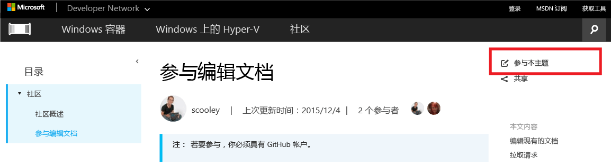

# <a name="contribute-to-the-docs"></a>参与编辑文档

> **注意：** 若要参与，必须具有 [GitHub](https://www.github.com) 帐户。

## <a name="edit-an-existing-doc"></a>编辑现有的文档

1. 查找你想要编辑的文档。  

2. 选择“**参与本主题**”  
  
  
  这会自动将你重定向到 GitHub 中与此文件相关联的标记文件。
  
  请确保已登录到 GitHub。  如果未登录，请登录或创建 GitHub 帐户。
  
  
  
3. 选择要使用浏览器编辑器进行编辑的编辑图标。
  
  

4. 使更改内联。
  
  可能的操作：
  1. 编辑文件
  2. 预览更改
  3. 重命名文件（你不太可能需要执行此操作）
  
  
  
5. 提出你的更改作为拉取请求
  
  

6. 查看你的更改
  
  **要在拉取请求中查找的内容**  
  * 更改正确 - 它准确地体现了此技术
  * 拼写/语法正确无误
  * 文档中的逻辑位置
    
  

7. 创建[拉取请求](contribute-to-docs.md#pull-requests)  

## <a name="pull-requests"></a>拉取请求

大多数更改将通过拉取请求提交  拉取请求是一种通过多个查看器查看更改集、对当前内容进行更改和注释的方式。


## <a name="fork-the-repo-and-edit-locally"></a>本地分叉和编辑存储库

对于长期的文档任务，请在本地克隆存储库，并在计算机上处理。

以下指南向你展示如何模拟我的（Sarah Cooley 的）设置。  有许多同等有效的替代设置。

> **注意：** 所有这些文档工具在 Linux/OSX 上同等有效。  如果需要其他指南，请提出。

这分为三个部分：
* [设置 Git](contribute-to-docs.md#set-up-git)
  * git 安装
  * 初始设置
  * 分叉文档存储库
  * 将副本克隆到本地计算机
* [初始凭据管理](contribute-to-docs.md#validate-and-stash-credentials)
  * 有关存储凭据和凭据帮助器的信息。
* [设置文档环境](contribute-to-docs.md#set-up-markdown-editing-environment)
  * 安装 VSCode
  * 用于 Git 的 VSCode 介绍一些方便的功能
  * 进行首个提交。

### <a name="set-up-git"></a>设置 Git

1. 从[此处](https://git-for-windows.github.io/)安装 git（在 Windows 上）

  在安装中只有一个值你需要更改：

  **调整你的 PATH 环境** 从 Windows 命令提示符处使用 Git

  

  这样就可以在 PowerShell 控制台/任何 Windows 控制台中使用 git 命令。

2. 配置 git 标识

  打开 PowerShell 窗口并运行：

  ``` PowerShell
  git config --global user.name "User Name"
  git config --global user.email username@microsoft.com
  ```

  Git 使用这些值来标记你的提交。

  > 如果收到以下错误，则可能未正确安装 git，或者你需要重新启动 PowerShell。
    ``` PowerShell
    git : The term 'git' is not recognized as the name of a cmdlet, function, script file, or operable program. Check the spelling of the name, or if a path was included, verify that the path is correct and try again.
    ```

3. 配置你的 git 环境

   设置凭据帮助器，以便只需输入用户名和密码一次（至少在此计算机上）。
   我使用此基本 [Windows 凭据帮助器](https://github.com/Microsoft/Git-Credential-Manager-for-Windows#download-and-install)

   安装后运行以下命令，启用凭据帮助器，并设置你的推送行为：
   ```
   git config --global credential.helper manager
   git config --global push.default simple
   ```

   第一次时需要对 GitHub 进行身份验证，将会提示你输入用户名和双重身份验证代码（如启用）。
   例如：
   ```
   C:\Users\plang\Source\Repos\Virtualization-Documentation [master]> git pull
   Please enter your GitHub credentials for https://github.com/
   username: plang@microsoft.com
   password:
   authcode (app): 562689
   ```
   这将在 GitHub 上自动生成具有适当权限的[个人访问令牌](https://github.com/settings/tokens)，然后将该令牌安全地存储在本地计算机上。 未来将不会再次提示你输入。

4. 分叉存储库

5. 克隆存储库

  Git 克隆将生成具有正确挂钩的 git 存储库的本地副本，可用于同步同一存储库中的其他克隆。

  默认情况下，克隆将使用当前目录中的存储库名称创建文件夹。  我将我的所有 git 存储库保留在我的用户目录中。  在[此处](http://git-scm.com/docs/git-clone)阅读有关 git 克隆的详细信息。

  ``` PowerShell
  cd ~
  git clone https://github.com/Microsoft/Virtualization-Documentation.git
  ```

  如果成功，现在将具有 `Virtualization-Documentation` 文件夹。

  ``` PowerShell
  cd Virtualization-Documentation
  ```

5. [可选] 设置 Posh-Git

  Posh-Git 是社区创建的 PowerShell 模块，使得在 PowerShell 中使用 Git 变得更加友好。  它在 PowerShell 中为 Git 添加 Tab 自动补全，还可使提示显示有关分支和文件状态的有用信息。  你可在[此处](https://github.com/dahlbyk/posh-git)阅读有关它的详细信息。  可以通过在管理员 PowerShell 控制台中运行以下命令来安装 Posh-Git。

  ``` PowerShell
  Install-Module -Name posh-git
  ```

  若要使 Posh-Git 在每次启动 PowerShell 时都会自动工作，请将以下代码添加到 PowerShell 配置文件（例如 `%UserProfile%\My Documents\WindowsPowerShell\profile.ps1 `）

  ``` PowerShell
  Import-Module posh-git

  function global:prompt {
    $realLASTEXITCODE = $LASTEXITCODE

    Write-Host($pwd.ProviderPath) -nonewline

    Write-VcsStatus

    $global:LASTEXITCODE = $realLASTEXITCODE
    return "> "
  }
  ```

### <a name="validate-and-stash-credentials"></a>验证并存储凭据

  若要验证已正确设置的存储库，请尝试拉取新内容。

  ``` PowerShell
  git pull
  ```


### <a name="set-up-markdown-editing-environment"></a>设置 markdown 编辑环境

1. 下载 VSCode

6. 进行测试提交。  如果凭据正确存储，都应顺畅工作。


