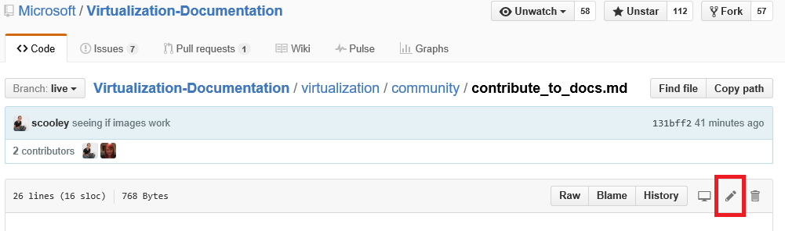
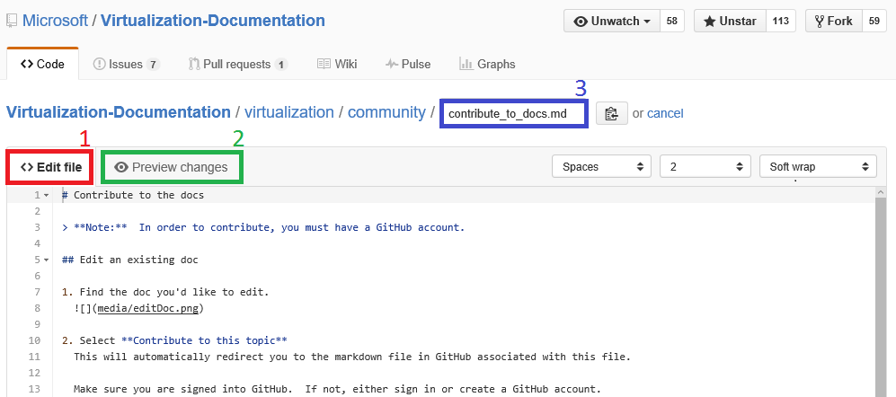

# 参与编辑文档

>**注意：**若要参与，必须具有 [GitHub](https://www.github.com) 帐户。

## 编辑现有的文档

1. 查找你想要编辑的文档。

2. 选择“参与本主题”

这会自动将你重定向到 GitHub 中与此文件相关联的标记文件。

请确保已登录到 GitHub。 如果未登录，请登录或创建 GitHub 帐户。

3. 选择要使用浏览器编辑器进行编辑的编辑图标。

4. 使更改内联。

可能的操作：
1. 编辑文件
2. 预览更改
3. 重命名文件（你不太可能需要执行此操作）

5. 提出你的更改作为拉取请求

6. 查看你的更改

**要在拉取请求中查找的内容**
* 更改正确 - 它准确地体现了此技术
* 拼写/语法正确无误
* 文档中的逻辑位置

7. 创建[拉取请求](contribute_to_docs.md#pull-requests)

## 拉取请求

大多数更改将通过拉取请求提交 拉取请求是一种通过多个查看器查看更改集、对当前内容进行更改和注释的方式。

<!--HONumber=Dec15_HO2-->
