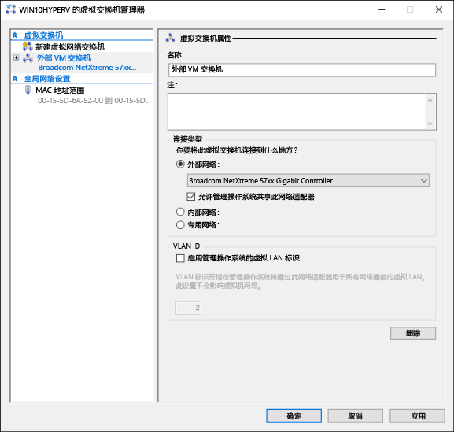
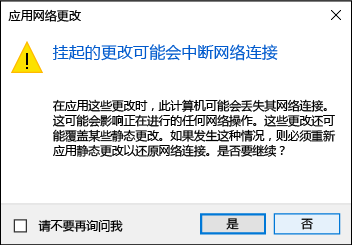

# <a name="create-a-virtual-network"></a>创建虚拟网络

你的虚拟机需要连接虚拟网络才能与你的计算机共享网络。  创建虚拟网络是可选的 -- 如果你的虚拟机不需要连接到 Internet 或网络，则跳到[创建 Windows 虚拟机](create-virtual-machine.md)。


## <a name="connect-virtual-machines-to-the-internet"></a>为虚拟机连接 Internet

Hyper-V 有三种类型的虚拟交换机 -- 外部、内部和专用。 创建外部交换机以与在其上运行的虚拟机共享计算机网络。

此练习演示了如何创建虚拟交换机。 完成后，Hyper-V 主机将拥有一个虚拟交换机，该虚拟交换机可通过计算机的网络连接来为虚拟机连接 Internet。 

### <a name="create-a-virtual-switch-with-hyper-v-manager"></a>使用 Hyper-V 管理器创建虚拟交换机

1. 打开 Hyper-V 管理器。  执行此操作的快速方法是按 Windows 按钮或密钥，然后键入“Hyper-V 管理器”。  
如果搜索未找到 Hyper-V 管理器，那是因为未启用 Hyper-V 或 Hyper-V 管理工具。  请参阅[启用 Hyper-V](enable-hyper-v.md) 的说明。

2. 在左窗格中选择服务器，或在右窗格中单击“连接到服务器…”。

3. 在 Hyper-V 管理器中，从右侧的“操作”菜单中选择**虚拟交换机管理器...**。 

4. 在“虚拟交换机”部分下，选择“**新建虚拟网络交换机**”。

5. 在“你要创建哪种类型的虚拟交换机?”下，选择“**外部**”。

6. 选择“**创建虚拟交换机**”按钮。

7. 在“虚拟交换机属性”下，为新交换机命名，如“**外部 VM 交换机**”。

8. 在“连接类型”下，确保已选择“**外部网络**”。

9. 选择要与新虚拟交换机配对的物理网卡。 这是以物理方式连接到网络的网卡。  

    

10. 选择“**应用**”来创建虚拟交换机。 此时，你很可能看到以下消息。 单击“**是**”继续。

      

11. 选择“**确定**”以关闭虚拟交换机管理器窗口。


### <a name="create-a-virtual-switch-with-powershell"></a>使用 PowerShell 创建虚拟交换机

以下步骤可用于使用 PowerShell 创建具有外部连接的虚拟交换机。 

1. 使用 **Get-NetAdapter** 返回连接到 Windows 10 系统的网络适配器列表。

    ```powershell
    PS C:\> Get-NetAdapter

    Name                      InterfaceDescription                    ifIndex Status       MacAddress             LinkSpeed
    ----                      --------------------                    ------- ------       ----------             ---------
    Ethernet 2                Broadcom NetXtreme 57xx Gigabit Cont...       5 Up           BC-30-5B-A8-C1-7F         1 Gbps
    Ethernet                  Intel(R) PRO/100 M Desktop Adapter            3 Up           00-0E-0C-A8-DC-31        10 Mbps  
    ```

2. 选择要用于 Hyper-V 交换机的网络适配器并将一个实例放入名为 **$net** 的变量中。

    ```
    $net = Get-NetAdapter -Name 'Ethernet'
    ```

3. 执行以下命令来创建新的 Hyper-V 虚拟交换机。

    ```
    New-VMSwitch -Name "External VM Switch" -AllowManagementOS $True -NetAdapterName $net.Name
    ```

## <a name="virtual-networking-on-a-laptop"></a>笔记本电脑上的虚拟网络

### <a name="nat-networking"></a>NAT 网络
网络地址转换 (NAT) 使用内部 Hyper-V 虚拟交换机对主机的 IP 地址与端口进行组合，以使虚拟机访问计算机的网络。

这会提供一些有用的属性：
1. NAT 会将外部 IP 地址和端口映射到更大的内部 IP 地址集，以转换 IP 地址。 
2. NAT 允许多个虚拟机托管需要相同（内部）通信端口的应用程序，方法是将它们映射到唯一的外部端口。
3. NAT 使用内部交换机—创建内部交换机不会要求使用网络连接，且往往对计算机网络的干扰较小。

若要设置 NAT 网络并将其连接到虚拟机，请遵循 [NAT 网络用户指南](../user-guide/setup-nat-network.md)。

### <a name="the-two-switch-approach"></a>双交换机方法

如果你要在笔记本电脑上运行 Windows 10 HYPER-V，并且经常在无线网络和有线的网络之间切换，你可能想要为以太网和无线网卡创建一个虚拟交换机。  具体取决于如何笔记本电脑连接到网络，你可以更改这些交换机之间的虚拟机。 虚拟机不改变有线和无线之间自动。 

>[!IMPORTANT]
>双交换机方法不支持通过无线网卡的外部 vSwitch，应仅用于测试目的。

## <a name="next-step---create-a-virtual-machine"></a>下一步 - 创建虚拟机
[创建 Windows 虚拟机](create-virtual-machine.md)
