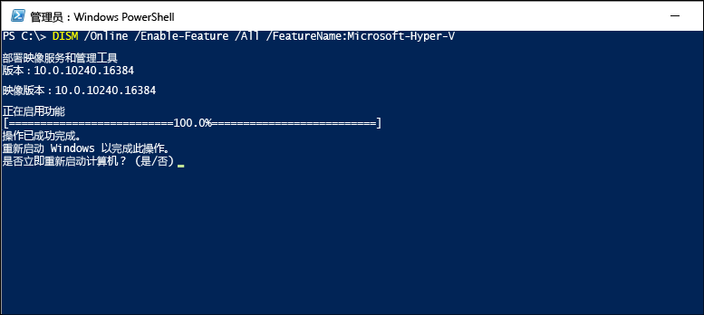
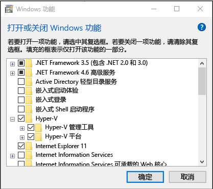

# <a name="install-hyper-v-on-windows-10"></a>在 Windows 10 上安装 Hyper-V

启用 Hyper-V 以在 Windows 10 上创建虚拟机。  
可以通过多种方式启用 Hyper-V，包括使用 Windows 10 控制面板、PowerShell（我的最爱）或使用部署映像服务和管理工具 (DISM)。 本文档将逐一介绍每个选项。

> **注意**：Hyper-V 作为可选功能内置于 Windows -- 无需下载 Hyper-V。

## <a name="check-requirements"></a>检查要求

* Windows 10 企业版、 专业版或教育版
* 具有二级地址转换 (SLAT) 的 64 位处理器。
* CPU 支持 VM 监视器模式扩展 (Intel Cpu 上 VT c)。
* 最小 4 GB 内存。

**请勿**在 Windows 10 家庭版上安装 Hyper-V 角色。

从 Windows 10 家庭版升级到 Windows 10 专业版通过打开**设置** > **更新和安全** > **激活**。

有关详细信息和疑难解答，请参阅 [Windows 10 Hyper-V 系统要求](../reference/hyper-v-requirements.md)。

## <a name="enable-hyper-v-using-powershell"></a>使用 PowerShell 启用 Hyper-V

1. 以管理员身份打开 PowerShell 控制台。

2. 运行以下命令：

  ```powershell
  Enable-WindowsOptionalFeature -Online -FeatureName Microsoft-Hyper-V -All
  ```

  如果无法找到此命令，请确保你以管理员身份运行 PowerShell。

安装完成后，请重启。

## <a name="enable-hyper-v-with-cmd-and-dism"></a>使用 CMD 和 DISM 启用 Hyper-V

部署映像服务和管理工具 (DISM) 可帮助配置 Windows 和 Windows 映像。  在众多应用程序中，DISM 可以在操作系统运行时启用 Windows 功能。

使用 DISM 启用 Hyper-V 角色：

1. 以管理员身份打开 PowerShell 或 CMD 会话。

1. 键入下列命令：

  ```powershell
  DISM /Online /Enable-Feature /All /FeatureName:Microsoft-Hyper-V
  ```

  

有关 DISM 的详细信息，请参阅 [DISM 技术参考](https://technet.microsoft.com/en-us/library/hh824821.aspx)。

## <a name="enable-the-hyper-v-role-through-settings"></a>通过“设置”启用 Hyper-V 角色

1. 右键单击 Windows 按钮并选择“应用和功能”。

2. 在右侧的相关设置中选择**程序和功能**。 

3. 选择“**打开或关闭 Windows 功能**”。

4. 选择 **Hyper-V**，然后单击**确定**。



安装完成后，系统会提示你重启计算机。

## <a name="make-virtual-machines"></a>创建虚拟机

[创建你的第一个虚拟机](quick-create-virtual-machine.md)
