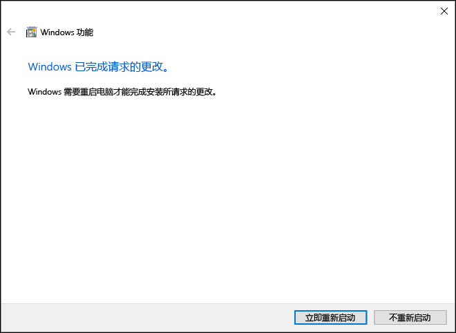

# 在 Windows 10 上安装 Hyper-V

启用 Hyper-V 以在 Windows 10 上创建虚拟机。  
可以通过多种方式启用 Hyper-V，包括使用 Windows 10 控制面板，PowerShell（我的最爱）或使用部署映像服务和管理工具 (DISM)。 本文档将逐一介绍每个选项。

> **注意**：Hyper-V 作为可选功能内置于 Windows -- 无 Hyper-V 下载或可安装的组件。 

## 检查要求

* Windows 10 企业版、专业版或教育版
* 具有二级地址转换 (SLAT) 的 64 位处理器。
* CPU 支持 VM 监视器模式扩展（Intel CPU 上的 VT-c）。
* 最小 4 GB 内存。

**请勿**在 Windows 10 家庭版上安装 Hyper-V 角色。  
打开**设置** > **更新和安全** > **激活**，从 Windows 10 家庭版升级到 Windows 10 专业版。

有关详细信息和疑难解答，请参阅 [Windows 10 Hyper-V 系统要求](../reference/hyper-v-requirements.md)。


## 安装 Hyper-V 
Hyper-V 作为可选功能内置于 Windows -- 无 Hyper-V 下载或可安装的组件。  有多种方法可以启用内置的 Hyper-V 角色。

### 使用 PowerShell 启用 Hyper-V

1. 以管理员身份打开 PowerShell 控制台。

2. 运行以下命令：
  ```powershell
  Enable-WindowsOptionalFeature -Online -FeatureName Microsoft-Hyper-V -All
  ```  

  如果无法找到此命令，请确保你以管理员身份运行 PowerShell。  

安装完成后，需要重新启动计算机。  

### 使用 CMD 和 DISM 启用 Hyper-V

部署映像服务和管理工具 (DISM) 可帮助配置 Windows 和 Windows 映像。  在众多应用程序中，DISM 可以在操作系统运行时启用 Windows 功能。  

使用 DISM 启用 Hyper-V 角色：
1. 以管理员身份打开 PowerShell 或 CMD 会话。

2. 键入下列命令：  
  ```powershell
  DISM /Online /Enable-Feature /All /FeatureName:Microsoft-Hyper-V
  ```  
  

有关 DISM 的详细信息，请参阅 [DISM 技术参考](https://technet.microsoft.com/en-us/library/hh824821.aspx)。

### 手动启用 Hyper-V 角色

1. 右键单击 Windows 按钮并选择“程序和功能”。

2. 选择“**打开或关闭 Windows 功能**”。

3. 选择“**Hyper-V**”，然后单击“**确定**”。  


安装完成后，系统会提示你重新启动计算机。




## 下一步 - 设置网络
[连接到 Internet](connect-to-network.md)

