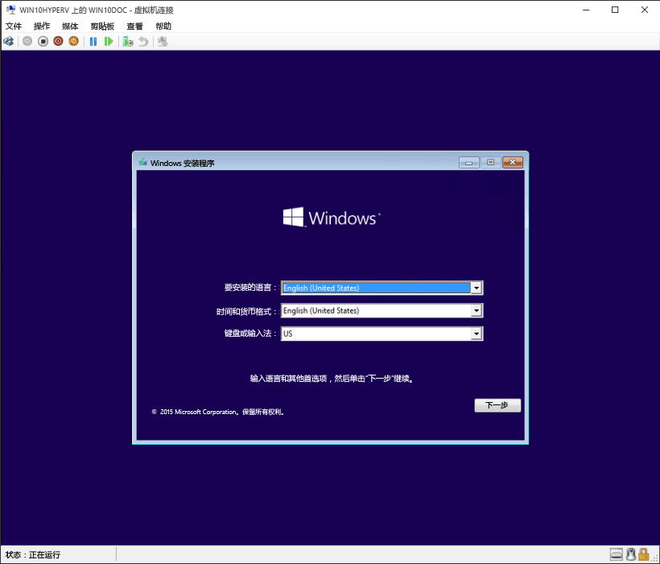

# 使用 Hyper-V 创建虚拟机

创建虚拟机并为其安装操作系统。  

你需要使用要运行的操作系统的 .iso 文件。 如果你手头上没有，请从 [TechNet 评估中心](http://www.microsoft.com/en-us/evalcenter/)获取 Windows 的评估副本。

> Windows 10 创意者更新引入了一个新的**快速创建**工具，以简化新虚拟机的构建过程。  
  如果运行的不是 Windows 10 创意者更新或更高版本，请按照以下说明进行操作并改用新的虚拟机向导：  
  [创建新的虚拟机](create-virtual-machine.md)  
  [创建虚拟网络](connect-to-network.md)

让我们开始吧。

1. **打开 Hyper-V 管理器**  
  按 Windows 键并键入“Hyper-V 管理器”以在应用程序中搜索 Hyper-V 管理器，或者在“开始”菜单中滚动浏览应用程序，直到找到 Hyper-V 管理器为止。

2. **打开“快速创建”**  
  在 Hyper-V 管理器内右侧的**操作**菜单中查找**快速创建**。

3. **自定义你的虚拟机**
  * （可选）为虚拟机命名。  
    这是 Hyper-V 用于虚拟机的名称，而不是提供给要部署到虚拟机内的来宾操作系统的计算机名称。
  * 选择虚拟机的安装媒体。 你可以从 .iso 或 .vhdx 文件中安装。  
    如果要在虚拟机中安装 Windows，你可以启用 Windows 安全启动。 否则，请不要选中。
  * 设置网络。  
    如果你有现成的虚拟交换机，则可以在网络下拉列表中进行选择。 如果你没有现成的虚拟交换机，你将看到一个用于设置自动网络的按钮，该按钮可以自动配置外部交换机。

4. **连接到虚拟机**  
  选择**连接**将启动虚拟机连接并启动虚拟机。     
  无需担心编辑设置，你可以随时返回去更改设置。  
  
    系统可能会提示你“按任意键以从 CD 或 DVD 启动”。 按照提示继续操作。  据了解，你将从 CD 安装。

恭喜，你有了新的虚拟机。  现在，你可以安装操作系统了。  

你的虚拟机应如下所示：  
 

> **注意：**除非你运行的是批量许可版本的 Windows，否则需要为虚拟机内运行的 Windows 提供单独的许可证。 虚拟机的操作系统独立于主机操作系统。
