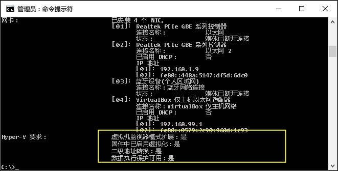

# Windows 10 Hyper-V 系统要求

Windows 10 上的 Hyper-V 仅适用于一组特定的操作系统和硬件配置。 本文档说明 Hyper-V 的要求，以及如何检查系统的兼容性。

## 操作系统要求

可以在以下版本的 Windows 10 上启用 Hyper-V 角色：

- Windows 10 企业版
- Windows 10 专业版
- Windows 10 教育版

**不能**在以下版本上安装 Hyper-V 角色：

- Windows 10 家庭版
- Windows 10 移动版
- Windows 10 移动企业版

>Windows 10 家庭版可以升级到 Windows 10 专业版。 若要执行此操作，请依次打开“**设置**” > “**更新和安全**” > “**激活**”。 可以在此处访问应用商店并购买升级。

## 硬件要求

虽然本文档未提供兼容 Hyper-V 的硬件完整列表，但需要具备以下各项：
    
- 具有二级地址转换 (SLAT) 的 64 位处理器。
- CPU 支持 VM 监视器模式扩展（Intel CPU 上的 VT-c）。
- 最小 4 GB 内存。 由于虚拟机与 Hyper-V 主机共享内存，因此将需要提供足够的内存来处理预期虚拟工作负荷。

需要在系统 BIOS 中启用以下各项：
- 虚拟化技术 - 可能具有不同标记，具体取决于主板制造商。
- 硬件强制实施的数据执行保护。

## 验证硬件兼容性

若要验证兼容性，请打开 PowerShell 或命令提示符 (cmd.exe)，然后键入 **systeminfo**。 如果列出的所有 Hyper-V 要求都具有值 **Yes**，则你的系统可以运行 Hyper-V 角色。 如果任一项返回**No**，请查看本文档中列出的要求并进行调整（如果可能）。



在现有 Hyper-V 主机上运行 **systeminfo** 时，Hyper-V 要求部分读取如下内容：

```
Hyper-V Requirements: A hypervisor has been detected. Features required for Hyper-V are not be displayed.
```


<!--HONumber=Jan17_HO2-->


