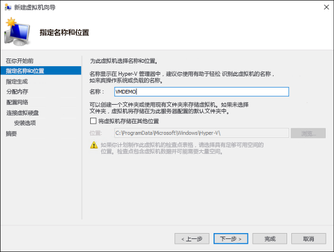
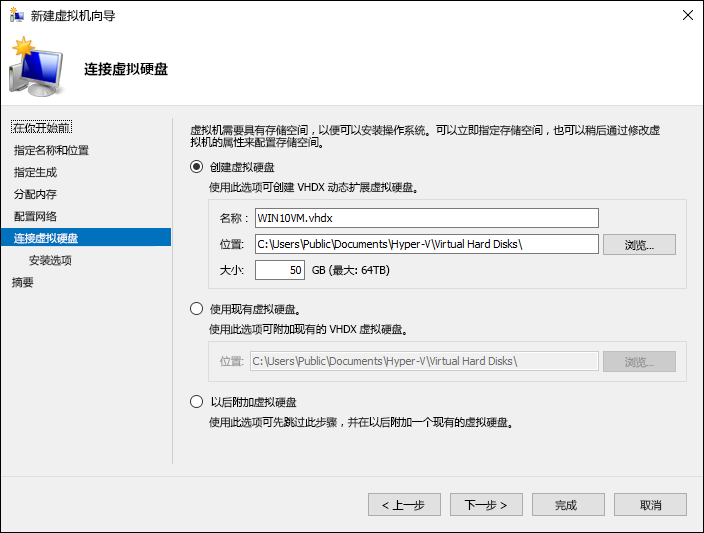
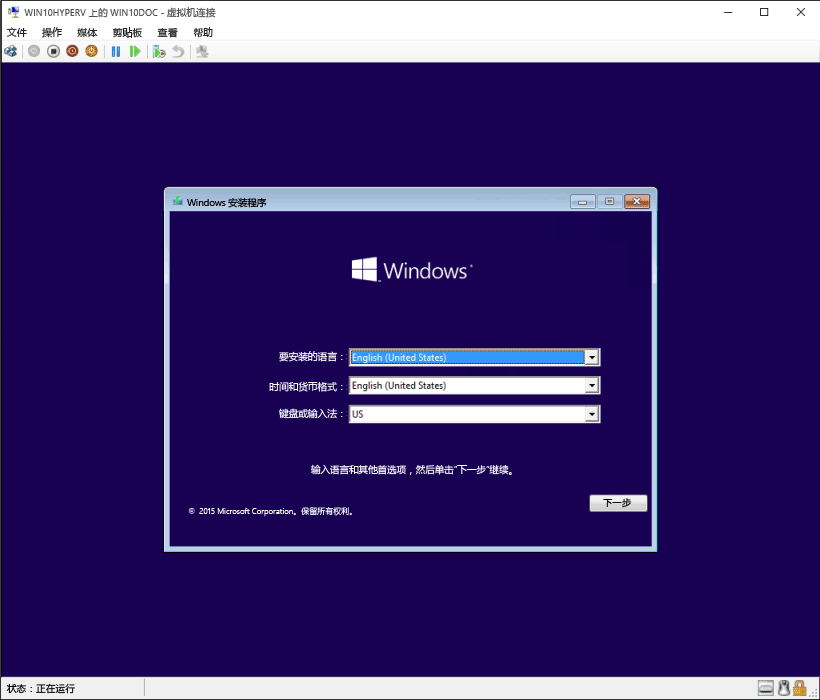

# 在 Windows 10 上的 Hyper-V 中部署 Windows 虚拟机

可以创建虚拟机并以多种不同方式将操作系统部署到其中，例如使用 Windows 部署服务、附加已准备就绪的虚拟硬盘驱动器或手动使用安装媒体。 本文介绍如何创建虚拟机并使用操作系统安装媒体将操作系统部署到该虚拟机的过程。

开始此练习之前，需要准备想要部署的操作系统的 .iso 文件。 如果需要，请从 [TechNet 评估中心](http://www.microsoft.com/en-us/evalcenter/)获取 Windows 8.1 或 Windows 10 的评估副本。

## 使用 Hyper-V 管理器创建虚拟机
以下步骤演练如何手动创建虚拟机并将操作系统部署到此虚拟机。

1. 在 Hyper-V 管理器中，依次单击“**操作**” > “**新建**” > “**虚拟机**”以显示“新建虚拟机向导”。

2. 查看“开始之前”内容，然后单击“**下一步**”。 

3. 为虚拟机命名。
  > **注意：**这是 Hyper-V 用于虚拟机的名称，而不是提供给来宾系统的将部署到虚拟机内的计算机名称。

4. 选择将存储虚拟机文件的位置，例如 **c:\virtualmachine**。 还可以接受默认位置。 操作完成后，单击“**下一步**”。
    
  

5. 选择虚拟机的世代，然后单击“**下一步**”。  

  第 2 代虚拟机已引入 Windows Server 2012 R2，并提供简化的虚拟硬件模型和一些其他功能。 只可以在第 2 代虚拟机上安装 64 位操作系统。 有关第 2 代虚拟机的详细信息，请参阅[第 2 代虚拟机概述](https://technet.microsoft.com/en-us/library/dn282285.aspx)。
  
  > 如果新的虚拟机配置为第 2 代，并且将运行 Linux 分发，则将需要禁用安全启动。 有关安全启动的详细信息，请参阅[安全启动](https://technet.microsoft.com/en-us/library/dn486875.aspx)。

6. 选择“**2048**”MB 作为“**启动内存**”值，并保持选择“**使用动态内存**”。 单击“**下一步**”按钮。  

  在 Hyper-V 主机和该主机上运行的虚拟机之间共享内存。 单台主机上可运行的虚拟机数量部分取决于可用内存。 还可以将虚拟机配置为使用动态内存。 启用后，动态内存从正在运行的虚拟机中回收未使用的内存。 这使得可在该主机上运行更多虚拟机。 有关动态内存的详细信息，请参阅 [Hyper-V 动态内存概述](https://technet.microsoft.com/en-us/library/hh831766.aspx)。

7. 在“配置网络”向导上，选择用于虚拟机的虚拟交换机，然后单击“**下一步**”。 有关详细信息，请参阅[创建虚拟交换机](walkthrough_virtual_switch.md)。

8. 为虚拟硬盘驱动器指定一个名称、选择一个位置或保留默认值，最后指定大小。 准备就绪后，单击“**下一步**”。

  与物理硬盘驱动器类似，虚拟硬盘驱动器为虚拟机提供存储空间。 必需提供虚拟硬盘驱动器，以便可以在虚拟机上安装操作系统。
  
    

9. 在“安装选项”向导上，选择“**从可启动的映像文件安装操作系统**”，然后选择操作系统 .iso 文件。 完成后，单击“**下一步**”。

  创建虚拟机时，可以配置一些操作系统安装选项。 可使用的三个选项如下：

  - **以后安装操作系统** – 此选项不会对虚拟机进行任何其他修改。

  - **从可启动的映像文件安装操作系统** – 这类似于将 CD 插入物理计算机的物理 CD-ROM 驱动器。 若要配置此选项，请选择 .iso 映像。 此映像将装载到虚拟机的虚拟 CD-ROM 驱动器。 虚拟机的启动顺序更改为首先从 CD-ROM 驱动器启动。

  - **从基于网络的安装服务器安装操作系统** – 除非已将虚拟机连接到网络交换机，否则此选项不可用。 在此配置中，虚拟机尝试从网络启动。
  
10. 查看虚拟机详细信息，然后单击“**完成**”以完成虚拟机创建。

## 使用 PowerShell 创建虚拟机

1. 以管理员身份打开 PowerShell ISE。

2. 运行以下脚本。

  ```powershell
  # Set VM Name, Switch Name, and Installation Media Path.
  $VMName = 'TESTVM'
  $Switch = 'External VM Switch'
  $InstallMedia = 'C:\Users\Administrator\Desktop\en_windows_10_enterprise_x64_dvd_6851151.iso'
  
  # Create New Virtual Machine
  New-VM -Name $VMName -MemoryStartupBytes 2147483648 -Generation 2 -NewVHDPath "D:\Virtual Machines\$VMName\$VMName.vhdx" -NewVHDSizeBytes 53687091200 -Path "D:\Virtual Machines\$VMName" -SwitchName $Switch
  
  # Add DVD Drive to Virtual Machine
  Add-VMScsiController -VMName $VMName
  Add-VMDvdDrive -VMName $VMName -ControllerNumber 1 -ControllerLocation 0 -Path $InstallMedia
  
  # Mount Installation Media
  $DVDDrive = Get-VMDvdDrive -VMName $VMName
  
  # Configure Virtual Machine to Boot from DVD
  Set-VMFirmware -VMName $VMName -FirstBootDevice $DVDDrive
  ```
  
## 完成操作系统部署

为了完成生成虚拟机操作，需要启动该虚拟机并演练操作系统安装过程。

1. 在 Hyper-V 管理器中，双击虚拟机。 这将启动 VMConnect 工具。

2. 在 VMConnect 中，单击绿色的“启动”按钮。 这类似于按物理计算机上的电源按钮。 系统可能会提示你“按任意键以从 CD 或 DVD 启动”。 按照提示继续操作。
  > **注意：**可能需要在 VMConnect 窗口内单击，以确保你的击键会发送到虚拟机。

3. 该虚拟机将启动到安装程序，并可指导你完成安装过程（如同在物理计算机上）。

   

> **注意：**除非你运行的是批量许可版本的 Windows，否则需要为虚拟机内运行的 Windows 提供单独的许可证。 虚拟机的操作系统独立于主机操作系统。

## 下一步 - 使用 PowerShell 和 Hyper V
[Hyper-V 和 Windows PowerShell](walkthrough_powershell.md)


<!--HONumber=Jun16_HO4-->


