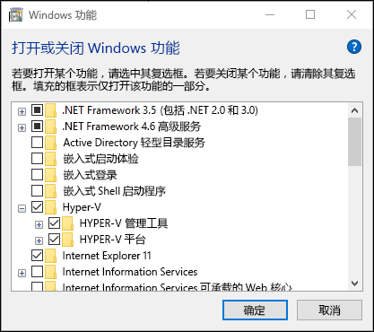
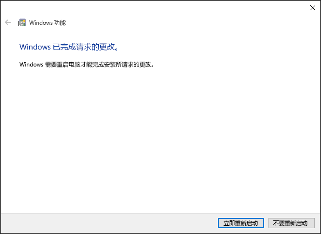
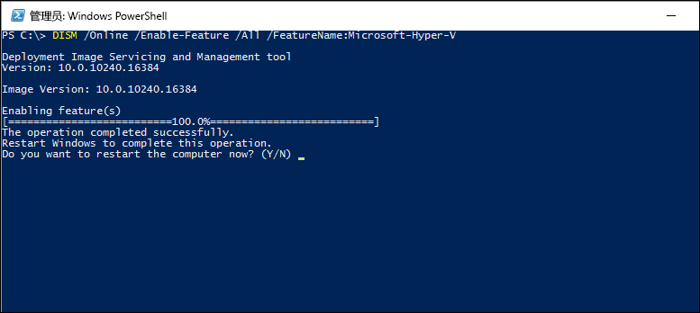

# 在 Windows 10 上安装 Hyper-V

必须先启用 Hyper-V 角色，然后才可以在 Windows 10 上创建虚拟机。 可使用 Windows 10 控制面板、PowerShell 或部署映像服务和管理工具 (DISM) 执行此操作。 本文档将演练上述每种方式。

> 启用 Hyper-V 之前，请确保与你的系统兼容。 有关详细信息，请参阅 [Windows 10 Hyper-V 系统要求](https://msdn.microsoft.com/virtualization/hyperv_on_windows/quick_start/walkthrough_compatibility)。

## 手动安装 Hyper-V 角色

1. 右键单击 Windows 按钮并选择“程序和功能”。

2. 选择“**打开或关闭 Windows 功能**”。

3. 选择“**Hyper-V**”，然后单击“**确定**”。  



安装完成后，系统会提示你重新启动计算机。



## 使用 PowerShell 安装 Hyper-V

1. 以管理员身份打开 PowerShell 控制台。

2. 运行以下命令：

```powershell
Enable-WindowsOptionalFeature -Online -FeatureName Microsoft-Hyper-V -All
```
安装完成后，需要重新启动计算机。

## 使用 DISM 安装 Hyper-V

部署映像服务和管理工具或 DISM 用于处理 Windows 映像并准备 Windows 预安装环境。 操作系统运行期间，DISM 还可用于启用 Windows 功能。 有关详细信息，请参阅 [DISM 技术参考](https://technet.microsoft.com/en-us/library/hh824821.aspx)。

使用 DISM 启用 Hyper-V 角色：

1. 以管理员身份打开 PowerShell 或 CMD 会话。

2. 键入下列命令：

```powershell
DISM /Online /Enable-Feature /All /FeatureName:Microsoft-Hyper-V
```



## 下一步 - 创建虚拟交换机
[创建虚拟交换机](walkthrough_virtual_switch.md)


<!--HONumber=Oct16_HO4-->


