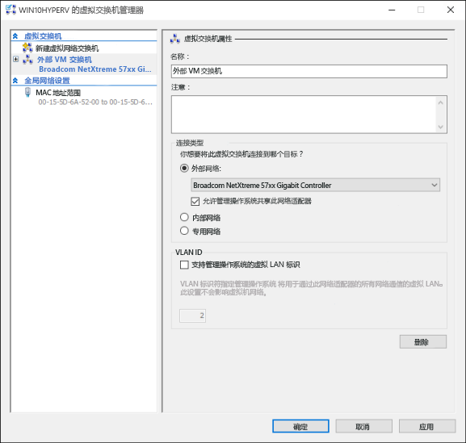
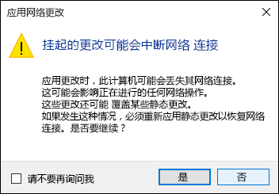

# 创建虚拟交换机

在 Hyper-V 中创建虚拟机之前，需要提供一个方法以供此虚拟机连接到物理网络。 Hyper-V 包括基于软件的网络技术，它允许虚拟机网卡连接到虚拟交换机，从而提供网络连接。 可以使用以下三种连接类型之一配置在 Hyper-V 中创建的每个虚拟交换机：

- **外部网络** – 虚拟交换机连接到物理网络适配器，可提供物理网络、Hyper-V 主机和虚拟机之间的连接。 在此配置中，还可以启用或禁用通过物理连接的网卡进行通信的主机功能。 这对于仅隔离到特定物理网卡的 VM 通信可能非常有用。

- **内部网络** – 虚拟交换机未连接到物理网络适配器，但虚拟机和 Hyper-V 主机之间存在网络连接。

- **专用网络** – 虚拟交换机未连接到物理网络适配器，且虚拟机和 Hyper-V 主机之间不存在连接。

## 手动创建虚拟交换机

本练习演练如何使用 Hyper-V 管理管理器创建外部虚拟交换机。 操作完成后，Hyper-V 主机包含的虚拟交换机可用于将虚拟机连接到物理网络。

1. 打开 Hyper-V 管理器。

2. 右键单击 Hyper-V 主机的名称，然后选择“虚拟交换机管理器”。

3. 在“虚拟交换机”下，选择“新建虚拟网络交换机”。

4. 在“创建虚拟交换机”下，选择“外部”。

5. 选择“创建虚拟交换机”按钮。

6. 在“虚拟交换机属性”下，为新交换机命名，如“外部 VM 交换机”>。

7. 在“连接类型”下，确保已选择“外部网络”。

8. 选择要与新的虚拟交换机配对的物理网卡，即以物理方式连接到网络的网卡。

    

9. 选择“应用”>来创建虚拟交换机。 此时，你很可能看到以下消息，单击“是”以继续。

    

10. 选择“确定”以关闭虚拟交换机管理器窗口。

## 使用 PowerShell 创建虚拟交换机

以下步骤可用于使用 PowerShell 创建具有外部连接的虚拟交换机。

1. 使用 **Get-NetAdapter** 返回连接到 Windows 10 系统的网络适配器列表。

```powershell
PS C:\> Get-NetAdapter

Name                      InterfaceDescription                    ifIndex Status       MacAddress             LinkSpeed
----                      --------------------                    ------- ------       ----------             ---------
Ethernet 2                Broadcom NetXtreme 57xx Gigabit Cont...       5 Up           BC-30-5B-A8-C1-7F         1 Gbps
Ethernet                  Intel(R) PRO/100 M Desktop Adapter            3 Up           00-0E-0C-A8-DC-31        10 Mbps  
```

2. 选择要用于 Hyper-V 交换机的网络适配器并将一个实例放入名为 **$net** 的变量中。

```
$net = Get-NetAdapter -Name 'Ethernet'
```

3. 执行以下命令来创建新的 Hyper-V 虚拟交换机。

```
New-VMSwitch -Name "External VM Switch" -AllowManagementOS $True -NetAdapterName $net.Name
```

## 虚拟交换机和笔记本电脑

如果在一台笔记本电脑上运行 Windows 10 Hyper-V，可能需要为以太网和无线网卡创建虚拟交换机。 使用此配置，可以更改这些交换机之间的虚拟机，具体取决于该笔记本电脑连接网络的方式。 虚拟机不会在有线和无线之间自动切换。

## 下一步 - 创建虚拟机

[创建 Windows 虚拟机](walkthrough_create_vm.md)


<!--HONumber=Dec15_HO1-->
