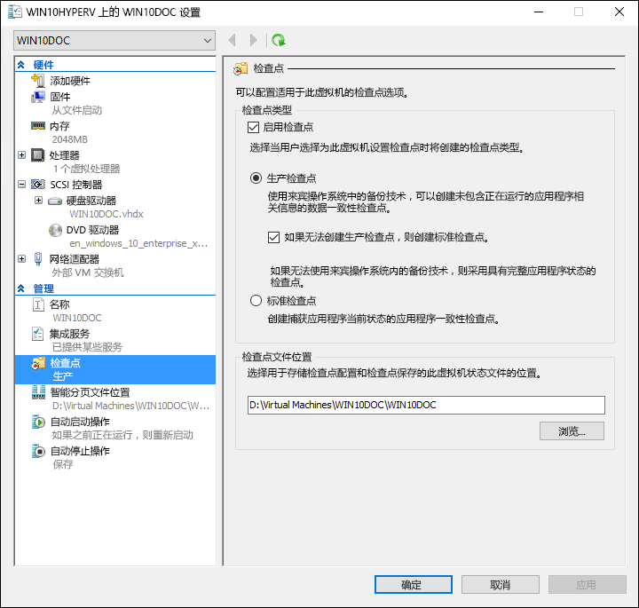
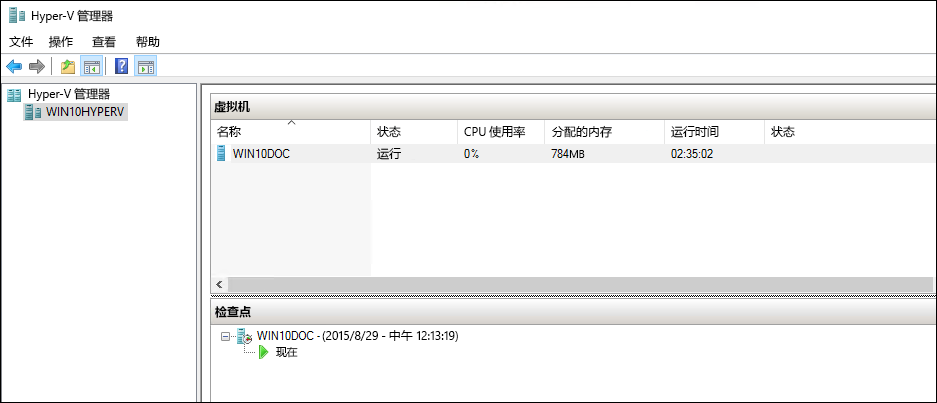
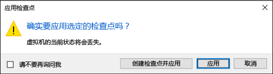
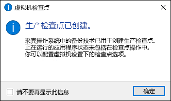

# 使用检查点将虚拟机恢复到以前的状态

虚拟化的最大优势之一是能够轻松地保存虚拟机的状态。 在 Hyper-V 中，通过使用虚拟机检查点完成此操作。 你可能想要先创建虚拟机检查点，然后进行软件配置更改、应用软件更新或安装新的软件。 如果系统更改导致问题，可以将该虚拟机恢复为创建检查点时其所处的状态。

Windows 10 Hyper-V 包括两种类型的检查点：

* **标准检查点** – 启动检查点时，获取虚拟机和虚拟机内存状态的快照。 快照并非完整备份，并可能导致系统在 Active Directory 等不同节点之间复制数据时出现数据一致性问题。 Hyper-V 只提供 Windows 10 之前的标准检查点（以前称为快照）。

* **生产检查点** – 在 Linux 虚拟机上使用卷影复制服务或文件系统冻结，以创建虚拟机的数据一致性备份。

默认情况下选择“生产检查点”，但可以使用 Hyper-V 管理器或 PowerShell 对该选择进行更改。

> **注意：**Hyper-V PowerShell 模块具有若干别名，以便检查点和快照可以互换使用。  
>   本文档使用检查点，但是请注意，你可能会看到使用术语快照的类似命令。

## 更改检查点类型

**使用 Hyper-V 管理器**

1. 打开 Hyper-V 管理器。
2. 右键单击虚拟机，然后选择“设置”****。
3. 在“管理”下，选择“检查点”****。
4. 选择所需的检查点类型。

<br />


**使用 PowerShell**

可以运行以下命令来使用 PowerShell 更改检查点。

设置为标准检查点：
```powershell
Set-VM -Name <vmname> -CheckpointType Standard
```

设置为生产检查点（如果生产检查点失败，则创建标准检查点）:
```powershell
Set-VM -Name <vmname> -CheckpointType Production
```

设置为生产检查点（如果生产检查点失败，未创建标准检查点）:
```powershell
Set-VM -Name <vmname> -CheckpointType ProductionOnly
```

## 创建检查点

创建为虚拟机配置的类型的检查点。 有关如何更改此类型的说明，请参阅本文档前面的[配置检查点类型](checkpoints.md#changing-the-checkpoint-type-for-a-VM)部分。

**使用 Hyper-V 管理器**

若要创建检查点：
1. 在 Hyper-V 管理器中，选择虚拟机。
2. 右键单击虚拟机的名称，然后单击“检查点”****。
3. 当此过程完成时，检查点将在“Hyper-V 管理器”****中的“检查点”****下显示。

**使用 PowerShell**

使用 **CheckPoint-VM** 命令创建检查点。

```powershell
Checkpoint-VM –Name <VMName>
```

当检查点过程完成时，使用 **Get-VMCheckpoint** 命令查看虚拟机的检查点列表。

```powershell
Get-VMCheckpoint -VMName <VMName>
```

## 应用检查点

如果你希望将虚拟机恢复到以前的时间点，你可以应用现有检查点。

**使用 Hyper-V 管理器**

1.  在“Hyper-V 管理器”****中的“虚拟机”****下，选择虚拟机。
2.  在“检查点”部分中，右键单击你想要使用的检查点，然后单击“应用”****。
3.  将显示一个带有以下选项的对话框：
    * **创建检查点和应用**：在虚拟机应用以前的检查点之前创建新的检查点。
    * **应用**：仅应用已选择的检查点。 不能撤消此操作。
    * **取消**：在不执行任何操作的情况下，关闭该对话框。

    选择任一“应用”选项来创建“应用检查点”。

**使用 PowerShell**

5. 若要查看虚拟机的检查点列表，请使用 **Get-VMCheckpoint** 命令。

    ```powershell
    Get-VMCheckpoint -VMName <VMName>
    ```
6. 若要应用检查点，请使用 **Restore-VMCheckpoint** 命令。

    ```powershell
    Restore-VMCheckpoint -Name <checkpoint name> -VMName <VMName> -Confirm:$false
    ```

## 重命名检查点

在某个特定点上创建多个检查点。 通过为其提供可识别的名称，更易于在创建检查点时记住有关系统状态的详细信息。

默认情况下，检查点的名称是虚拟机的名称与采用该检查点时的日期和时间的组合。 这是标准格式：

```
virtual_machine_name (MM/DD/YYY –hh:mm:ss AM\PM)
```

名称限制为 100 个字符或更少，并且名称不能为空。

**使用 Hyper-V 管理器**

1.  在“Hyper-V 管理器”****中，选择虚拟机。
2.  右键单击检查点，然后选择“重命名”****。
3.  输入检查点的新名称。 它必须小于 100 个字符，并且该字段不能为空。
4.  完成后，单击“Enter”****。

**使用 PowerShell**

``` powershell
Rename-VMCheckpoint –VMName <virtual machine name> –Name <checkpoint name> --NewName <new checkpoint name>
```

## 删除检查点

删除检查点可以帮助在 Hyper-V 主机上创建空间。

在后台，检查点在与虚拟机的 .vhdx 文件的相同位置中存储为 .avhdx 文件。 在删除检查点时，Hyper-V 会为你合并 .avhdx 和 .vhdx 文件。 完成后，将从文件系统中删除检查点的 .avhdx 文件。

不应直接删除 .avhdx 文件。

**使用 Hyper-V 管理器**

若要完全删除检查点：

1.  在“Hyper-V 管理器”****中，选择虚拟机。
2.  在“检查点”****部分中，右键单击要删除的检查点，然后单击“删除”。 你还可以删除检查点和所有后续检查点。 若要执行此操作，请右键单击要删除的最早的检查点，然后单击“**删除检查点”****子树**。
3.  系统可能会询问你确认是否要删除该检查点。 确认它是正确的检查点，然后单击“删除”****。

**使用 PowerShell**
```powershell
Remove-VMCheckpoint –VMName <virtual machine name> –Name <checkpoint name>
```

## 导出检查点

导出会将检查点捆绑为虚拟机，以便检查点可以移动到新的位置。 导入后，检查点将还原为虚拟机。 导出的检查点可用于备份。

**使用 PowerShell**
``` powershell
Export-VMCheckpoint –VMName <virtual machine name>  –Name <checkpoint name> -Path <path for export>
```

## 启用或禁用检查点

1.  在“Hyper-V 管理器”****中，右键单击虚拟机的名称，然后单击“设置”****。
2.  在“管理”****部分中，选择“检查点”****。
3.  若要允许采用此虚拟机的检查点，请确保已选中“启用检查点”，这是默认的行为。  
    若要禁用检查点，请取消选中“启用检查点”****复选框。
4.  单击“应用”****来应用你的更改。 如果已完成操作，请单击“确定”****来关闭对话框。

## 配置检查点位置

如果虚拟机没有检查点，你可以更改检查点配置和已保存状态文件的存储位置。

1.  在“Hyper-V 管理器”****中，右键单击虚拟机的名称，然后单击“设置”****。
2.  在“管理”****部分中，选择“检查点”****或“检查点文件位置”****。
4.  在“检查点文件位置”****中，输入你希望存储文件的文件夹的路径。
5.  单击“应用”****来应用你的更改。 如果已完成操作，请单击“确定”****来关闭对话框。

用于存储检查点配置文件的默认位置为：`%systemroot%\ProgramData\Microsoft\Windows\Hyper-V\Snapshots`。


## 检查点演示

本练习将演练创建和应用标准检查点与生产检查点。 对于此示例，将对虚拟机进行简单更改并观察不同的行为。

### 标准检查点

1. 登录到虚拟机并在桌面上创建文本文件。
2. 用“记事本”打开该文件，然后输入文本“这是标准检查点”。 **不要保存文件或者关闭记事本**。
3. 将检查点更改为标准 - [此处](checkpoints.md#changing-the-checkpoint-type-using-hyper-V-manager)提供相关说明。
4. 创建新检查点。

<br />


**使用 Hyper-V 管理器应用标准检查点**

现在，检查点已存在，对虚拟机进行修改，然后应用该检查点以将该虚拟机恢复为已保存状态。

1. 关闭该文本文件（如果它仍处于打开状态），然后将其从虚拟机桌面中删除。
2. 打开 Hyper-V 管理器、右键单击标准检查点，然后选择“应用”。
3. 在“应用检查点通知”窗口上，选择“应用”。

<br />


应用该检查点后，请注意，不但文本文件存在，而且该系统仍处于创建检查点时其所处的状态。 在这种情况下，“记事本”处于打开状态并且已加载该文本文件。

### 生产检查点

现在让我们检验生产检查点。 此过程与使用标准检查点几乎完全相同，但结果略有不同。 开始之前，请确保你已有虚拟机并已将检查点类型更改为生产检查点。

**修改虚拟机并创建生产检查点**

1. 登录到虚拟机并创建新的文本文件。 如果你一直按照此练习进行操作，可以使用现有文本文件。
2. 在该文本文件中输入“这是生产检查点”， 在文本文件中，保存该文件，但**不要关闭记事本**。
3. 打开 Hyper-V 管理器 > 右键单击虚拟机 > 选择“检查点”****。
4. 在“生产检查点创建”窗口上，单击“确定”****。

<br />


**使用 Hyper-V 管理器应用生产检查点**

现在，检查点已存在，对系统进行修改，然后应用该检查点以将该虚拟机恢复为已保存状态。

1. 关闭该文本文件（如果它仍处于打开状态），然后将其从虚拟机桌面中删除。
2. 打开 Hyper-V 管理器、右键单击生产检查点，然后选择“应用”****。
3. 在“应用检查点通知”窗口上，选择“应用”****。

应用生产检查点后，请注意，该虚拟机将处于关闭状态。

1. 启动并登录到虚拟机。
2. 请注意，该文本文件已还原。 但不同于标准检查点，“记事本”未处于打开状态。


