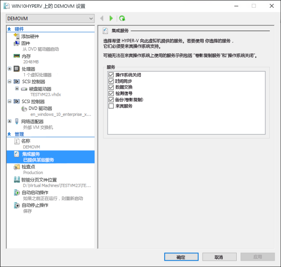
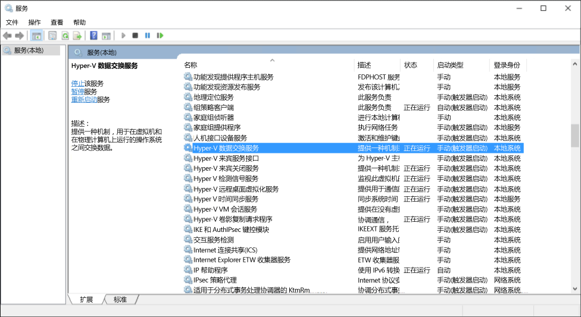

# 管理 Hyper-V 集成服务

集成服务（通常称为集成组件）是允许虚拟机与 Hyper-V 主机通信的服务。 其中许多服务都很便利（例如来宾文件副本），但其他服务对来宾操作系统能够正常工作（时间同步）却至关重要。

本文将详细介绍如何在 Windows 10 中使用 Hyper-V 管理器和 PowerShell 管理集成服务。 有关各单独集成服务的详细信息，请参阅[Integration Services]( https://technet.microsoft.com/en-us/library/dn798297.aspx)（集成服务）。

## 使用 Hyper-V 管理器启用或禁用集成服务

1. 选择虚拟机并打开设置。
  
  
2. 从虚拟机设置窗口中，转到“管理”下的“集成服务”选项卡。
  
  
  
  在此你可以看到此 Hyper-V 主机上可用的所有集成服务。  值得注意的是，来宾操作系统可能会也可能不会支持列出的所有集成服务。

## 使用 PowerShell 启用或禁用集成服务

集成服务也可运行 [`Enable-VMIntegrationService`](https://technet.microsoft.com/en-us/library/hh848500.aspx) 和 [`Disable-VMIntegrationService`](https://technet.microsoft.com/en-us/library/hh848488.aspx) 来通过 PowerShell 进行启用和禁用。

在此示例中，我们将在上面所示的“demovm”虚拟机上启用并随后禁用来宾文件副本集成服务。

1. 查看正在运行的集成服务
  
  ``` PowerShell
  Get-VMIntegrationService -VMName "demovm"
  ```

  输出将如下所示：  
  ``` PowerShell
  VMName      Name                    Enabled PrimaryStatusDescription SecondaryStatusDescription
  ------      ----                    ------- ------------------------ --------------------------
  demovm      Guest Service Interface False   OK
  demovm      Heartbeat               True    OK                       OK
  demovm      Key-Value Pair Exchange True    OK
  demovm      Shutdown                True    OK
  demovm      Time Synchronization    True    OK
  demovm      VSS                     True    OK
  ```

2. 启用 `Guest Service Interface` 集成服务

   ``` PowerShell
   Enable-VMIntegrationService -VMName "demovm" -Name "Guest Service Interface"
   ```
   
   如果运行 `Get-VMIntegrationService -VMName "demovm"`，你将看到“来宾服务接口”集成服务已启用。
 
3. 禁用`Guest Service Interface`集成服务

   ``` PowerShell
   Disable-VMIntegrationService -VMName "demovm" -Name "Guest Service Interface"
   ```
   
集成服务已经过设计，以便需要在主机和来宾中同时启用才能正常运行。  虽然 Windows 来宾操作系统上的所有集成服务默认处于启用状态，但也可以禁用它们。  请参阅下一节中的操作方式。


## 在来宾操作系统 (Windows) 中管理集成服务

> **注意：**禁用集成服务可能严重影响主机管理你的虚拟机的功能。  必须在主机和来宾上启用集成服务才能操作。

集成服务在 Windows 中显示为服务。 若要在虚拟机中启用或禁用集成服务，请打开 Windows 服务管理器。

 

查找名称中包含 Hyper-V 的服务。 右键单击要启用或禁用的服务，并启动或停止服务。

或者，若要查看带有 PowerShell 的所有集成服务，请运行：

```PowerShell
Get-Service -Name vm*
```

这将返回如下所示的列表：

```PowerShell
Status   Name               DisplayName
------   ----               -----------
Running  vmicguestinterface Hyper-V Guest Service Interface
Running  vmicheartbeat      Hyper-V Heartbeat Service
Running  vmickvpexchange    Hyper-V Data Exchange Service
Running  vmicrdv            Hyper-V Remote Desktop Virtualizati...
Running  vmicshutdown       Hyper-V Guest Shutdown Service
Running  vmictimesync       Hyper-V Time Synchronization Service
Stopped  vmicvmsession      Hyper-V VM Session Service
Running  vmicvss            Hyper-V Volume Shadow Copy Requestor
```

使用 [`Start-Service`](https://technet.microsoft.com/en-us/library/hh849825.aspx) 或 [`Stop-Service`](https://technet.microsoft.com/en-us/library/hh849790.aspx) 启动或停止服务。

例如，要禁用 PowerShell Direct，你可以运行 `Stop-Service -Name vmicvmsession`。

默认情况下，所有集成服务在来宾操作系统中均已启用。

## 在来宾操作系统 (Linux) 中管理集成服务

Linux 集成服务通常通过 Linux 内核提供。

通过在 Linux 来宾操作系统中运行以下命令，查看集成服务驱动程序和守护程序是否在运行。

1. Linux 集成服务驱动程序称为“hv_utils”。  运行以下命令，以查看它是否已加载。

  ``` BASH
  lsmod | grep hv_utils
  ``` 
  
  输出应如下所示：  
  
  ``` BASH
  Module                  Size   Used by
  hv_utils               20480   0
  hv_vmbus               61440   8 hv_balloon,hyperv_keyboard,hv_netvsc,hid_hyperv,hv_utils,hyperv_fb,hv_storvsc
  ```

2. 在 Linux 来宾操作系统中运行以下命令，以查看所需的守护程序是否在运行。
  
  ``` BASH
  ps -ef | grep hv
  ```
  
  输出应如下所示：  
  
  ``` BASH
  root       236     2  0 Jul11 ?        00:00:00 [hv_vmbus_con]
  root       237     2  0 Jul11 ?        00:00:00 [hv_vmbus_ctl]
  ...
  root       252     2  0 Jul11 ?        00:00:00 [hv_vmbus_ctl]
  root      1286     1  0 Jul11 ?        00:01:11 /usr/lib/linux-tools/3.13.0-32-generic/hv_kvp_daemon
  root      9333     1  0 Oct12 ?        00:00:00 /usr/lib/linux-tools/3.13.0-32-generic/hv_kvp_daemon
  root      9365     1  0 Oct12 ?        00:00:00 /usr/lib/linux-tools/3.13.0-32-generic/hv_vss_daemon
  scooley  43774 43755  0 21:20 pts/0    00:00:00 grep --color=auto hv          
  ```
  
  若要查看哪些守护程序可用，请运行：
  ``` BASH
  compgen -c hv_
  ```
  
  输出应如下所示：
  
  ``` BASH
  hv_vss_daemon
  hv_get_dhcp_info
  hv_get_dns_info
  hv_set_ifconfig
  hv_kvp_daemon
  hv_fcopy_daemon     
  ```
  
  在集成服务守护程序中，你可能会看到：  
  * **`hv_vss_daemon`** – 创建实时 Linux 虚拟机备份，需要此守护程序。
  * **`hv_kvp_daemon`** – 此守护程序允许设置和查询内部与外部键值对。
  * **`hv_fcopy_daemon`** – 此守护程序实现主机与来宾之间的文件复制服务。

> **注意：**如果以上集成服务守护程序不可用，则你的系统可能不支持它们，或者可能无法安装它们。  从[此处](https://technet.microsoft.com/en-us/library/dn531030.aspx)查找更多 disto 特定信息。  

在此示例中，我们将停止和启动 KVP 守护程序 `hv_kvp_daemon`。

使用位于上述输出的第二列中的 pid（进程 ID）停止守护程序的进程。  另外，你可以使用 `pidof` 查找正确进程。  因为 Hyper-V 守护程序作为根运行，所以需要根权限。

``` BASH
sudo kill -15 `pidof hv_kvp_daemon`
```

现在，如果你再次运行 `ps -ef | hv`，将发现所有 `hv_kvp_daemon` 进程消失了。

若要再次启用守护程序，请将守护程序作为根运行。

``` BASH
sudo hv_kvp_daemon
``` 

现在，如果你再次运行 `ps -ef | hv`，将发现所有 `hv_kvp_daemon` 进程有一个新的进程 ID。


## 集成服务维护

若要接收可能的最佳虚拟机性能和功能，请将集成服务保持最新状态。

**对于在 Windows 10 主机上运行的虚拟机：**

> **注意：**更新集成组件不再需要 ISO 镜像文件 vmguest.iso。 它未包含在 Windows 10 上的 Hyper-V 中。

| 来宾操作系统 | 更新机制 | 注释 |
|:---------|:---------|:---------|
| Windows 10 | Windows 更新 | |
| Windows 8.1 | Windows 更新 | |
| Windows 8 | Windows 更新 | 需要“数据交换”集成服务。* |
| Windows 7 | Windows 更新 | 需要“数据交换”集成服务。* |
| Windows Vista (SP 2) | Windows 更新 | 需要“数据交换”集成服务。* |
| - | | |
| Windows Server 2012 R2 | Windows 更新 | |
| Windows Server 2012 | Windows 更新 | 需要“数据交换”集成服务。* |
| Windows Server 2008 R2 (SP 1) | Windows 更新 | 需要“数据交换”集成服务。* |
| Windows Server 2008 (SP 2) | Windows 更新 | Server 2016 中仅限扩展支持（[阅读更多](https://support.microsoft.com/en-us/lifecycle?p1=12925)）。 |
| Windows Home Server 2011 | Windows 更新 | Server 2016 中不受支持（[阅读更多](https://support.microsoft.com/en-us/lifecycle?p1=15820)）。 |
| Windows Small Business Server 2011 | Windows 更新 | 非主要支持（[阅读更多](https://support.microsoft.com/en-us/lifecycle?p1=15817)）。 |
| - | | |
| Linux 来宾 | 程序包管理器 | 适用于 Linux 的集成组件内置于发行版中，但可能有可选的更新可用。 ******** |

>  \* 如果“数据交换”集成服务无法启用，在下载中心上，[此处](https://support.microsoft.com/en-us/kb/3071740)这些来宾的集成组件提供为Cabinet (cab) 文件。  
  [此处](http://blogs.technet.com/b/virtualization/archive/2015/07/24/integration-components-available-for-virtual-machines-not-connected-to-windows-update.aspx)提供应用 Cab 的说明。


**对于在 Windows 8.1 主机上运行的虚拟机：**

| 来宾操作系统 | 更新机制 | 注释 |
|:---------|:---------|:---------|
| Windows 10 | Windows 更新 | |
| Windows 8.1 | Windows 更新 | |
| Windows 8 | 集成服务磁盘 | |
| Windows 7 | 集成服务磁盘 | |
| Windows Vista (SP 2) | 集成服务磁盘 | |
| Windows XP（SP 2、SP 3） | 集成服务磁盘 | |
| - | | |
| Windows Server 2012 R2 | Windows 更新 | |
| Windows Server 2012 | 集成服务磁盘 | |
| Windows Server 2008 R2 | 集成服务磁盘 | |
| Windows Server 2008 (SP 2) | 集成服务磁盘 | |
| Windows Home Server 2011 | 集成服务磁盘 | |
| Windows Small Business Server 2011 | 集成服务磁盘 | |
| Windows Server 2003 R2 (SP 2) | 集成服务磁盘 | |
| Windows Server 2003 (SP 2) | 集成服务磁盘 | |
| - | | |
| Linux 来宾 | 程序包管理器 | 适用于 Linux 的集成组件内置于发行版中，但可能有可选的更新可用。 ** |


**对于在 Windows 8 主机上运行的虚拟机：**

| 来宾操作系统 | 更新机制 | 注释 |
|:---------|:---------|:---------|
| Windows 8.1 | Windows 更新 | |
| Windows 8 | 集成服务磁盘 | |
| Windows 7 | 集成服务磁盘 | |
| Windows Vista (SP 2) | 集成服务磁盘 | |
| Windows XP（SP 2、SP 3） | 集成服务磁盘 | |
| - | | |
| Windows Server 2012 R2 | Windows 更新 | |
| Windows Server 2012 | 集成服务磁盘 | |
| Windows Server 2008 R2 | 集成服务磁盘 | |
| Windows Server 2008 (SP 2) | 集成服务磁盘 | |
| Windows Home Server 2011 | 集成服务磁盘 | |
| Windows Small Business Server 2011 | 集成服务磁盘 | |
| Windows Server 2003 R2 (SP 2) | 集成服务磁盘 | |
| Windows Server 2003 (SP 2) | 集成服务磁盘 | |
| - | | |
| Linux 来宾 | 程序包管理器 | 适用于 Linux 的集成组件内置于发行版中，但可能有可选的更新可用。 ** |


[此处](https://technet.microsoft.com/en-us/library/hh846766.aspx#BKMK_step4)提供通过 Windows 8 和 Windows 8.1 的集成服务磁盘进行更新的说明。

 > ** 在[此处](https://technet.microsoft.com/en-us/library/dn531030.aspx)查找有关 Linux 来宾的详细信息。 


<!--HONumber=Jun16_HO4-->


