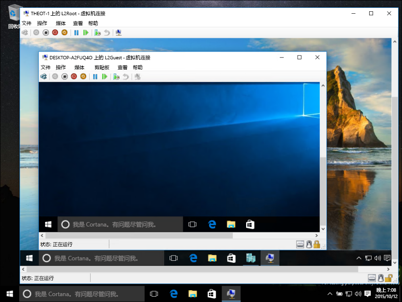
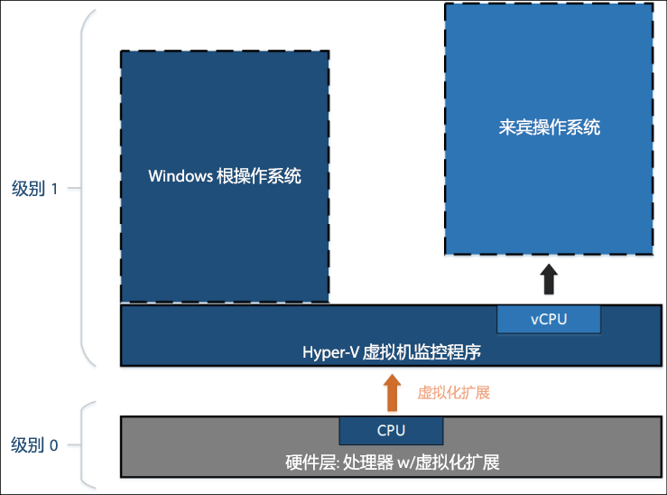
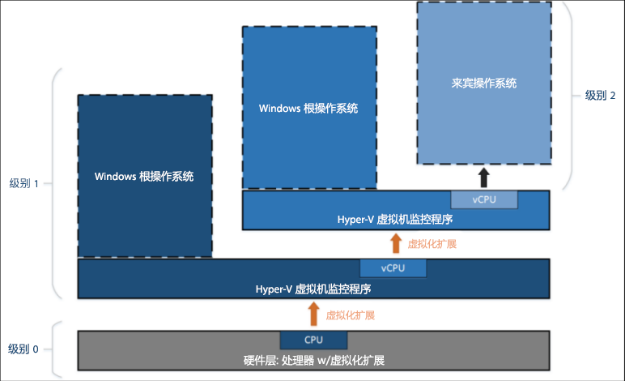

# 嵌套虚拟化

>**注意：**此早期的预览功能仅向运行版本 10565 或更高版本的 Windows 预览体验成员提供，并且不保证性能或稳定性。

嵌套虚拟化在虚拟化的环境中运行虚拟化。 换句话说，嵌套允许你在虚拟机中运行 Hyper-V 服务器角色。



Hyper-V 依赖硬件虚拟化支持（例如 Intel VT-x 和 AMD-V）来运行虚拟机。 通常情况下，安装 Hyper-V 后，虚拟机监控程序会向来宾虚拟机隐藏此功能。 这可以阻止来宾虚拟机在其他虚拟机监控程序中运行 Hyper-V 服务器角色。

嵌套虚拟化会向来宾虚拟机公开这些硬件虚拟化支持组件。

下图显示了没有嵌套的 Hyper-V。 Hyper-V 虚拟机监控程序完全控制硬件虚拟化扩展（橙色箭头），并且不会向来宾操作系统公开它们。



相反，下图显示了带有嵌套的 Hyper-V。 在此情况下，Hyper-V 会向其虚拟机公开硬件虚拟化扩展。 启用嵌套后，来宾虚拟机可以安装其自己的虚拟机监控程序并运行其自己的来宾 VM。



## 嵌套虚拟化要求

在启用嵌套虚拟化之前，请注意这是预览版。 不要在生产环境中使用嵌套。

要求：
* 最少 4 GB 的可用 RAM。 嵌套虚拟化要求大量内存。
* 两个虚拟机监控程序必须是最新的 Windows 预览体验成员版本（10565 或更高版本）。 其他虚拟机监控程序不会运行。
* 此功能当前仅用于 Intel。 Intel VT-x 是必需项。

## 启用嵌套虚拟化

1. 创建与主机运行相同版本的虚拟机 -- [此处提供相关说明](../quick_start/walkthrough_create_vm.md)。

2. 在 Hyper-V 主机上以管理员身份运行[此脚本](https://github.com/Microsoft/Virtualization-Documentation/blob/master/hyperv-tools/Nested/Enable-NestedVm.ps1)。

在此早期预览版中，嵌套具有一些配置要求。 为使操作变得更简单，[此 PowerShell 脚本](https://github.com/Microsoft/Virtualization-Documentation/blob/master/hyperv-tools/Nested/Enable-NestedVm.ps1)脚本会检查你的配置、更改错误内容，并为指定的虚拟机启用嵌套虚拟化。

  ``` PowerShell
  Invoke-WebRequest https://raw.githubusercontent.com/Microsoft/Virtualization-Documentation/master/hyperv-tools/Nested/Enable-NestedVm.ps1 -OutFile ~/Enable-NestedVm.ps1 
  ~/Enable-NestedVm.ps1 -VmName "DemoVM"
  ```

3. 在虚拟机中安装 Hyper-V。

  ``` PowerShell
  Invoke-Command -VMName "DemoVM" -ScriptBlock { Enable-WindowsOptionalFeature -FeatureName Microsoft-Hyper-V -Online; Restart-Computer }
  ```

4. 创建嵌套虚拟机！

## 已知问题

下面是已知问题列表：
* 启用了 Device Guard 的主机无法向来宾公开虚拟化扩展。

* 启用了基于虚拟化的安全 (VBS) 的主机无法向来宾公开虚拟化扩展。 若要预览嵌套虚拟化，必须先禁用 VBS。

* 在虚拟机中启用嵌套虚拟化后，以下功能将不再与该 VM 兼容。
这些操作将失败或导致虚拟机无法启动（如果该虚拟机托管了其他虚拟机）：
* 必须关闭动态内存。 这会阻止 VM 启动。
* 无法调整运行时内存大小。
* 无法将检查点应用到正在运行的 VM。
* 无法进行实时迁移，也即是说，无法实时迁移托管其他 VM 的 VM。
* 无法保存/还原。

>**注意：**这些功能在“内部”来宾 VM 中仍然可用。 这些限制仅适用于第一层 VM。

* 启用了嵌套虚拟化后，必须在虚拟机中启用 MAC 欺骗，以便在“内部”来宾中联网。

## 常见问题和疑难解答

### 我的虚拟机无法启动，我应该怎么做？

1. 请确保动态内存已关闭。
2. 在主机上从提升的提示符中运行此 PowerShell 脚本。

此脚本报告是否针对嵌套正确配置了主机和 VM。

  ``` PowerShell
  Invoke-WebRequest https://raw.githubusercontent.com/Microsoft/Virtualization-Documentation/master/hyperv-tools/Nested/Get-NestedVirtStatus.ps1 -OutFile ~/Get-NestedVirtStatus.ps1 
  ~/Get-NestedVirtStatus.ps1
  ```

### 虚拟机连接一直处于断开状态。

如果你使用的密码为空，则这是一个已知问题。 请更改你的密码，该问题就应该会得到解决。

### 在这里找不到我的问题。

没看到你的问题？ 有反馈？ 请与我们联系。

通过 Windows 反馈应用、[虚拟化论坛](https://social.technet.microsoft.com/Forums/windowsserver/En-us/home?forum=winserverhyperv)或通过 [GitHub](https://github.com/Microsoft/Virtualization-Documentation) 报告它们。


<!--HONumber=Dec15_HO1-->
