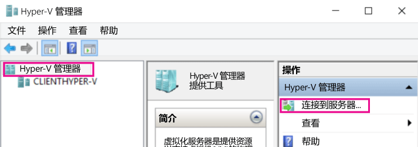
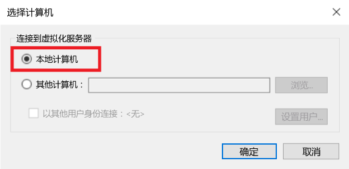
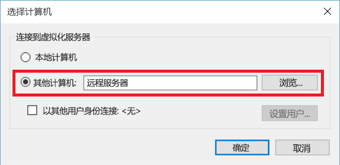
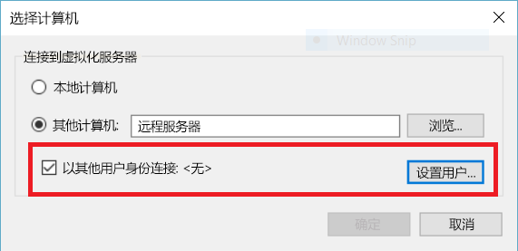

# 通过 Hyper-V 管理器管理远程 Hyper-V 主机

Hyper-V 管理器是内置工具，用于诊断和管理本地 Hyper-V 主机和小部分远程主机。  本文记录了在所有受支持的配置中使用 Hyper-V 管理器连接 Hyper-V 主机的配置步骤。

> 像在[任何包括 Hyper-V 的 Windows 操作系统](../quick_start/walkthrough_compatibility.md#OperatingSystemRequirements)上的“**Hyper-V 管理工具**”一样，Hyper-V 管理器通过“**程序和功能**”提供。  管理远程主机无需启用 Hyper-V 平台。

若要在 Hyper-V 管理器中连接 Hyper-V 主机，请确保在左侧窗格中选择“Hyper-V 管理器”，然后在右侧窗格中选择“连接到服务器...”。



## 与 Hyper-V 管理器组合的受支持的 Hyper-V 主机
Windows 10 中的 Hyper-V 管理器允许你管理以下 Hyper-V 主机：
* Windows 10
* Windows 8.1
* Windows 8
* Windows Server 2016 - 所有版本和安装选项（包括 Nano 服务器），以及 Hyper-V 服务器的相应版本
* Windows Server 2012 R2 - 所有版本和安装选项，以及 Hyper-V 服务器的相应版本
* Windows Server 2012 - 所有版本和安装选项，以及 Hyper-V 服务器的相应版本

Windows 8.1 和 Windows Server 2012 R2 中的 Hyper-V 管理器允许你管理：
* Windows 8.1
* Windows 8
* Windows Server 2012 R2 - 所有版本和安装选项，以及 Hyper-V 服务器的相应版本
* Windows Server 2012 - 所有版本和安装选项，以及 Hyper-V 服务器的相应版本

Windows 8 和 Windows Server 2012 中的 Hyper-V 管理器允许你管理：
* Windows 8
* Windows Server 2012 - 所有版本和安装选项，以及 Hyper-V 服务器的相应版本

Windows 7 和 Windows Server 2008 R2 中的 Hyper-V 管理器允许你管理：
* Windows Server 2008 R2 - 所有版本和安装选项，以及 Hyper-V 服务器的相应版本

Windows Vista 和 Windows Server 2008 中的 Hyper-V 管理器允许你管理：
* Windows Server 2008 - 所有版本和安装选项，以及 Hyper-V 服务器的相应版本

> **注意：**Hyper-V 管理器功能与可用于所管理版本的功能相匹配。 换言之，如果你要从 Windows Server 2012 R2 管理远程 Windows Server 2012 主机，Windows Server 2012 R2 中的新 Hyper-V 管理器功能将不可用。

## 管理本地主机 ##
若要将本地主机作为 Hyper-V 主机添加到 Hyper-V 管理器，请选择“选择计算机”对话框中的“本地计算机”。



如果无法建立连接：
*  请确保启用 Hyper-V 平台角色。  
  若要查看 Hyper-V 是否受支持，请参阅[检查兼容性的演练部分](../quick_start/walkthrough_compatibility.md)。
*  请确认用户帐户是 Hyper-V 管理员组的一部分。


## 在相同域中管理其他 Hyper-V 主机 ##

若要将远程 Hyper-V 主机添加到 Hyper-V 管理器，请选择“**选择计算机**”对话框中的“**其他计算机**”，并将远程主机的主机名、NetBIOS 或 FQDN 输入到文本字段中。



若要管理远程 Hyper-V 主机，必须在本地计算机和远程主机上启用远程管理。

你可以通过 `System Properties -> Remote Management Settings` 或以管理员身份运行以下 PowerShell 命令来执行此操作：  

``` PowerShell
Enable-PSRemoting
```

如果当前用户帐户与远程主机上的 Hyper-V Administrator 帐户相匹配，请继续操作并按“**确定**”进行连接。  

> 这是在 Windows 8 或 Windows 8.1 的 Hyper-V 管理器中管理远程主机的唯一受支持的方法。


Windows 10 极大地增加了远程连接类型的可能组合。  
现在，你可以使用主机名或 IP 地址连接到远程 Windows 10 或更高版本的主机。  Hyper-V 管理器现在也支持备用用户凭据。  


### 以其他用户身份连接远程主机
> 这仅在连接到 Windows 10 或 Windows Server 2016 Technical Preview 3 或更高版本的远程主机时才可用

在 Windows 10 中，如果没有使用远程主机的正确用户帐户运行，可以以拥有备用凭据的其他用户身份连接。

若要指定远程 Hyper-V 主机的凭据，请选中“**选择计算机**”对话框中的“**以其他用户身份连接:**”，然后选择“**设置用户...**”。




### 使用 IP 地址连接远程主机
> 这仅在连接到 Windows 10 或 Windows Server 2016 Technical Preview 3 或更高版本的远程主机时才可用

有时使用 IP 地址会比使用主机名更易于连接。 Windows 10 就可以让你做到这一点。

若要使用 IP 地址连接，请将 IP 地址输入到“**其他计算机**”文本字段中。


## 在域之外（或没有域的情况下）管理 Hyper-V 主机 ##
> 这仅在连接到 Windows 10 或 Windows Server 2016 Technical Preview 3 或更高版本的远程主机时才可用

在要管理的 Hyper-V 主机上，以管理员身份运行以下内容：

1.  [Enable-PSRemoting](https://technet.microsoft.com/en-us/library/hh849694.aspx)
  * [Enable-PSRemoting](https://technet.microsoft.com/en-us/library/hh849694.aspx) 将创建*专用*网络区域所需的防火墙规则。 若要在公共区域上允许此访问权限，需要启用 CredSSP 和 WinRM 的规则。
2.  [Enable-WSManCredSSP](https://technet.microsoft.com/en-us/library/hh849872.aspx) -Role server

在管理 PC 上，以管理员身份运行以下命令：

1. Set-Item WSMan:\localhost\Client\TrustedHosts -Value "fqdn-of-hyper-v-host"
2. [Enable-WSManCredSSP](https://technet.microsoft.com/en-us/library/hh849872.aspx) -Role client -DelegateComputer "fqdn-of-hyper-v-host"
3. 此外，你需要配置以下组策略：** 计算机配置 | 管理模板 | 系统 | 凭据委派 | 允许分配新的凭据用于仅 NTLM 服务器身份验证**
    * 单击“**启用**”并添加 *wsman/fqdn-of-hyper-v-host*


<!--HONumber=Sep16_HO3-->


