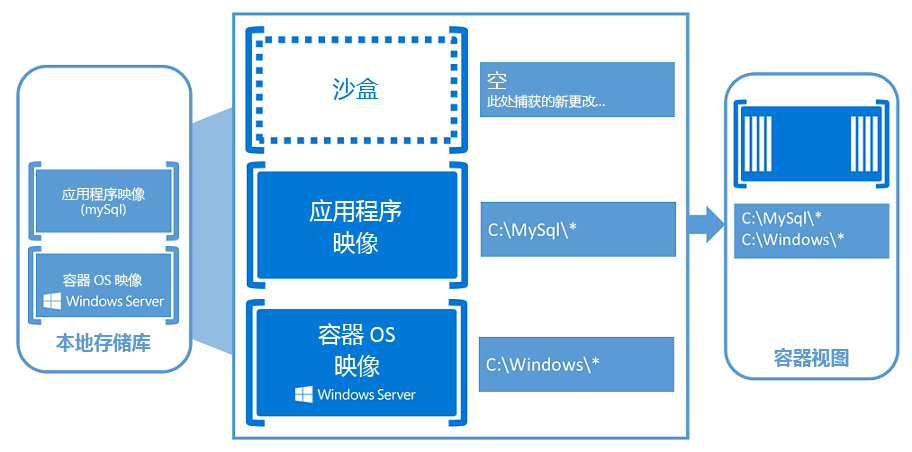

# Windows 容器

应用程序激发云和移动时代的创新。 容器以及围绕它们开发的生态系统将支持软件开发人员创建下一代的应用程序体验。

观看简短概述：[基于 Windows 的容器：使用企业级控制的现代应用开发](https://youtu.be/Ryx3o0rD5lY)。

## 什么是容器

它们是隔离、资源控制且可移植的操作环境。

基本上，容器是一个隔离的位置，应用程序可在其中运行，而不会影响系统的其他部分，并且系统也不会影响该应用程序。 容器是虚拟化的下一个演化。

如果你在容器内，看起来会很像你在一个新安装的物理计算机或虚拟机内。 并且，对 [Docker](https://www.docker.com/) 来说，可以使用与任何其他容器相同的方式管理 Windows Server 容器。

## Windows 容器

Windows 容器包括两个不同的容器类型或运行时。

**Windows Server 容器** - 通过进程和命名空间隔离技术提供应用程序隔离。 Windows Server 容器与容器主机和该主机上运行的所有容器共享内核。

**Hyper-V 容器** - 通过在高度优化的虚拟机中运行每个容器，在由 Windows Server 容器提供的隔离上扩展。 在此配置中，容器主机的内核不与 Hyper-V 容器共享。

## 容器基础知识

当你开始使用容器时，你会注意到容器和虚拟机之间的许多相似之处。 容器在操作系统上运行、具有文件系统，并且可以通过网络访问，就像它是物理或虚拟计算机系统一样。 话虽如此，但容器背后的技术和概念与虚拟机有很大不同。

Mark Russinovich 所著的[此博客文章](http://azure.microsoft.com/blog/2015/08/17/containers-docker-windows-and-trends/)很好地解释了容器。

在你开始创建和使用 Windows 容器时，以下关键概念将会很有用。

**容器主机：**使用 Windows 容器功能配置的物理或虚拟计算机系统。 容器主机将运行一个或多个 Windows 容器。

**容器映像：**在对容器文件系统或注册表进行修改时（如使用软件安装），将在沙盒中捕获它们。 在许多情况下，你可能希望捕获此状态，以便可以创建继承这些更改的新容器。 这就是映像的本质：一旦容器停止，你便可以放弃该沙盒，或者可以将其转换为新的容器映像。 例如，让我们想象你已从 Windows Server Core 操作系统映像部署一个容器。 然后你将 MySQL 安装到此容器中。 从此容器创建新映像将充当该容器的可部署版本。 此映像将只包含所做的更改 (MySQL)，但是将充当容器操作系统映像之上的一个层。

**沙盒：**启动容器后，将在此“沙盒”层中捕获所有写入操作，如文件系统修改、注册表修改或软件安装。

**容器操作系统映像：**从映像部署容器。 容器操作系统映像是可能组成容器的许多映像层中的第一层。 此映像提供操作系统环境。 容器操作系统映像不可变，并且无法修改。

**容器存储库：**每次创建容器映像时，容器映像及其依赖项都会存储在本地存储库中。 这些映像可以在容器主机上重复使用多次。 容器映像还可以存储在公共或私有注册表（如 DockerHub）中，以便可以在许多不同的容器主机上使用它们。

**容器管理技术：**可以使用 PowerShell 和 Docker 管理 Windows 容器。 借助这些工具之一，你可以创建新的容器、容器映像并管理容器生命周期。

## 面向开发人员的容器

从开发人员的桌面到测试计算机再到一组生产计算机，可以创建以相同方式在几秒内在任何环境中部署的 Docker 映像。 由此创造出了封装在 Docker 容器中的巨大且持续增长的应用程序生态系统，其中 DockerHub 是 Docker 所维护的公共容器化应用程序注册表，当前已在公共社区存储库中发布超过 180,000 个应用程序。

当你容器化某个应用时，仅该应用以及运行该运用所需的组件将组合到“映像”中。 然后根据你的需要从此映像创建容器。 你还可以使用映像作为创建其他映像的基线，从而使映像创建速度更快。 多个容器可以共享同一个映像，这意味着容器将非常快速地启动，并使用更少的资源。 例如，你可以使用容器为已分配的应用起转轻型和可移植的应用组件（或“微服务”），并快速单独缩放每个服务。

由于容器具有运行应用程序所需的一切，因此它们非常易于移植，并且可在运行 Windows Server 2016 的任何计算机上运行。 你可以本地创建和测试容器，然后将该相同的容器映像部署到你的公司的私有云、公有云或服务提供商。 容器的自然灵活性支持大规模、虚拟化和云环境中的现代应用开发模式。

借助容器，开发人员可以采用任何语言生成应用。 这些应用完全可移植，并且可在任何位置（笔记本电脑、台式机、服务器、私有云、公有云或服务提供商）运行，而无需任何代码更改。

容器有助于开发人员更快地生成和交付更高质量的应用程序。

## 面向 IT 专业人员的容器

IT 专业人员可以使用容器来为其开发、QA 和生产团队提供标准化环境。 他们不再需要担心复杂的安装和配置步骤。 通过使用容器，系统管理员抽象出操作系统安装和底层基础结构中的差异。

容器有助于管理员创建更易于更新和维护的基础结构。

## 视频概述

<iframe 
src="https://channel9.msdn.com/Blogs/containers/Containers-101-with-Microsoft-and-Docker/player#ccLang=zh-cn" width="800" height="450" allowFullScreen="true" frameBorder="0" scrolling="no"></iframe>

## 试用 Windows Server 容器

[Windows Azure 中的 Windows 容器入门](../quick_start/azure_setup.md)  
[本地使用 Windows 容器入门](../quick_start/container_setup.md)

<!--HONumber=Feb16_HO3-->

