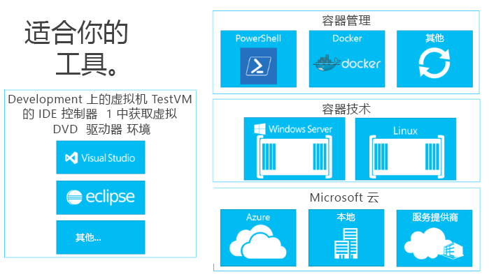

# 生成容器生态系统

若要了解为何生成容器生态系统如此重要，让我们先介绍一下 Docker。

## Docker 的魅力

容器的概念（命名空间隔离和资源管理）已存在很长时间，可以追溯到 BSD Jails、Solaris Zones 和基本的 UNIX chroot（更改根）机制。 Docker 的用途是提供通用工具集、封装模型和部署机制。 通过完成此目的，Docker 大大简化了应用程序的容器化和分配。 然后可以在任何 Linux 主机上的任何位置运行这些应用程序，此功能也在 Windows 上提供。

这种无处不在的技术不仅通过对任何主机提供相同的管理命令来简化管理，而且还为无缝 DevOps 创造独特的机会。

从开发人员的桌面到测试计算机再到一组生产计算机，可以创建以相同方式在几秒内在任何环境中部署的 Docker 映像。 由此创造出了封装在 Docker 容器中的巨大且持续增长的应用程序生态系统，其中 DockerHub 是 Docker 所维护的公共容器化应用程序注册表。

Docker 为开发提供了绝佳的基础。

现在让我们谈一谈应用程序的生态系统以及你可以如何以 Docker 概念为基础创建适合你的需求的开发和部署工作流。

## 容器生态系统中的组件

Windows 容器是一个大型容器生态系统的关键组成部分。 我们正致力于跨行业在解决方案堆栈的每一层上为开发人员提供选项。

容器生态系统提供管理容器、共享容器和开发在容器中运行的应用的方法。

Microsoft 希望在开发人员生成这些下一代的应用时为其提供选项和工作效率。 我们的目标是为开发人员提高效率，这意味着支持应用程序面向任何 Microsoft 云，而无需修改、重新编写或重新配置代码。

Microsoft 致力于以友好方式实现开放和生态系统。 我们积极支持融合多个相关的开发人员生态系统（如 Windows 和 Linux）来推动创新。

在随后的几个月内，我们将提供有关此开发生态系统中的其他合作伙伴的详细信息。

