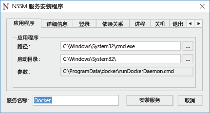
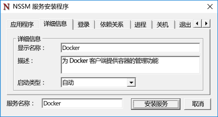
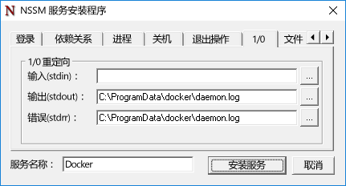

# Docker 和 Windows

**这是初步内容，可能还会更改。** 

Windows 中不含 Docker 引擎，需要单独进行安装和配置。 用于在 Windows 上运行 Docker 引擎的步骤与用于在 Linux 上运行该引擎的步骤有所不同。 本文档将逐步完成在 Windows Server 2016、Nano Server 和 Windows 客户端上安装和配置 Docker 引擎。 另请注意，Docker 引擎和命令行界面最近已拆分为两个文件。 本文档包括安装它们的说明。

有关 Docker 和 Docker 工具集的详细信息，请访问 [Docker.com](https://www.docker.com/)。 

> 必须先启用 Windows 容器功能，然后才能使用 Docker 创建和管理 Windows 容器。 有关启用此功能的说明，请参阅[容器主机部署指南](./docker_windows.md)。

## Windows Server 2016

### 安装 Docker 守护程序 <!--1-->

从 `https://aka.ms/tp5/dockerd` 下载 docker.exe，并将其放在容器主机上的 System32 目录中。

```none
wget https://aka.ms/tp5/dockerd -OutFile $env:SystemRoot\system32\dockerd.exe
```

创建名为 `c:\programdata\docker` 的目录。 在此目录中，创建名为 `runDockerDaemon.cmd` 的文件。

```none
New-Item -ItemType File -Path C:\ProgramData\Docker\runDockerDaemon.cmd -Force
```

将下列文本复制并到 `runDockerDaemon.cmd` 文件中。

```none
@echo off
set certs=%ProgramData%\docker\certs.d

if exist %ProgramData%\docker (goto :run)
mkdir %ProgramData%\docker

:run
if exist %certs%\server-cert.pem (if exist %ProgramData%\docker\tag.txt (goto :secure))

if not exist %systemroot%\system32\dockerd.exe (goto :legacy)

dockerd -H npipe:// 
goto :eof

:legacy
docker daemon -H npipe:// 
goto :eof

:secure
if not exist %systemroot%\system32\dockerd.exe (goto :legacysecure)
dockerd -H npipe:// -H 0.0.0.0:2376 --tlsverify --tlscacert=%certs%\ca.pem --tlscert=%certs%\server-cert.pem --tlskey=%certs%\server-key.pem
goto :eof

:legacysecure
docker daemon -H npipe:// -H 0.0.0.0:2376 --tlsverify --tlscacert=%certs%\ca.pem --tlscert=%certs%\server-cert.pem --tlskey=%certs%\server-key.pem
```
从 [https://nssm.cc/release/nssm-2.24.zip](https://nssm.cc/release/nssm-2.24.zip) 下载 nssm.exe。

```none
wget https://nssm.cc/release/nssm-2.24.zip -OutFile $env:ALLUSERSPROFILE\nssm.zip
```

提取压缩包。

```none
Expand-Archive -Path $env:ALLUSERSPROFILE\nssm.zip $env:ALLUSERSPROFILE
```

将 `nssm-2.24\win64\nssm.exe` 复制到 `c:\windows\system32` 目录中。

```none
Copy-Item $env:ALLUSERSPROFILE\nssm-2.24\win64\nssm.exe $env:SystemRoot\system32
```
运行 `nssm install` 以配置 Docker 服务。

```none
start-process nssm install
```

在 NSSM 服务安装程序中将以下数据输入到相应的字段中。

应用程序选项卡：

**路径：**C:\Windows\System32\cmd.exe

**启动目录：**C:\Windows\System32

**参数：**/s /c C:\ProgramData\docker\runDockerDaemon.cmd < nul

**服务名称** - Docker



详细信息选项卡：

**显示名称：**Docker

**说明：**Docker 守护程序为 Docker 客户端提供容器的管理功能。



IO 选项卡：

**输出 (stdout)：**C:\ProgramData\docker\daemon.log

**错误 (stderr)：**C:\ProgramData\docker\daemon.log



完成后，单击`Install Service`按钮。

Docker 守护程序现已配置为 Windows 服务。

### 防火墙 <!--1-->

如果想要启用远程 Docker 管理，则还需要打开 TCP 端口 2376。

```none
netsh advfirewall firewall add rule name="Docker daemon " dir=in action=allow protocol=TCP localport=2376
```

### 删除 Docker <!--1-->

下面的命令将删除 Docker 服务。

```none
sc.exe delete Docker
```

### 安装 Docker CLI

从 `https://aka.ms/tp5/docker` 下载 docker.exe，并将其放在容器主机或你将在其中运行 Docker 命令的任何其他系统的 System32 目录中。

```none
wget https://aka.ms/tp5/docker -OutFile $env:SystemRoot\system32\docker.exe
```

## Nano Server

### 安装 Docker <!--2-->

从 `https://aka.ms/tp5/dockerd` 下载 docker.exe，并将其复制到 Nano Server 容器主机的 `windows\system32` 文件夹。

创建名为 `c:\programdata\docker` 的目录。 在此目录中，创建名为 `runDockerDaemon.cmd` 的文件。

```none
New-Item -ItemType File -Path C:\ProgramData\Docker\runDockerDaemon.cmd -Force
```

将下列文本复制并到 `runDockerDaemon.cmd` 文件中。

```none
@echo off
set certs=%ProgramData%\docker\certs.d

if exist %ProgramData%\docker (goto :run)
mkdir %ProgramData%\docker

:run
if exist %certs%\server-cert.pem (if exist %ProgramData%\docker\tag.txt (goto :secure))

if not exist %systemroot%\system32\dockerd.exe (goto :legacy)

dockerd -H npipe:// 
goto :eof

:legacy
docker daemon -H npipe:// 
goto :eof

:secure
if not exist %systemroot%\system32\dockerd.exe (goto :legacysecure)
dockerd -H npipe:// -H 0.0.0.0:2376 --tlsverify --tlscacert=%certs%\ca.pem --tlscert=%certs%\server-cert.pem --tlskey=%certs%\server-key.pem
goto :eof

:legacysecure
docker daemon -H npipe:// -H 0.0.0.0:2376 --tlsverify --tlscacert=%certs%\ca.pem --tlscert=%certs%\server-cert.pem --tlskey=%certs%\server-key.pem
```

下面的脚本可用于创建计划的任务，它将在 Windows 启动时启动 Docker 守护程序。

```none
# Creates a scheduled task to start docker.exe at computer start up.

$dockerData = "$($env:ProgramData)\docker"
$dockerDaemonScript = "$dockerData\runDockerDaemon.cmd"
$dockerLog = "$dockerData\daemon.log"
$action = New-ScheduledTaskAction -Execute "cmd.exe" -Argument "/c $dockerDaemonScript > $dockerLog 2>&1" -WorkingDirectory $dockerData
$trigger = New-ScheduledTaskTrigger -AtStartup
$settings = New-ScheduledTaskSettingsSet -Priority 5
Register-ScheduledTask -TaskName Docker -Action $action -Trigger $trigger -Settings $settings -User SYSTEM -RunLevel Highest | Out-Null
Start-ScheduledTask -TaskName Docker 
```

### 防火墙 <!--2-->

如果想要启用远程 Docker 管理，则还需要打开 TCP 端口 2376。

```none
netsh advfirewall firewall add rule name="Docker daemon " dir=in action=allow protocol=TCP localport=2376
```

### 交互式 Nano 会话

Nano Server 的管理通过远程 PowerShell 会话进行。 有关远程管理 Nano Server 的信息，请参阅 [Nano Server 入门]( https://technet.microsoft.com/en-us/library/mt126167.aspx#bkmk_ManageRemote)。

并非所有 docker 操作（如“docker 附加”）都可通过此远程 PowerShell 会话执行。 要解决这个问题，并作为通常情况下的最佳做法，请通过安全的 TCP 连接从远程客户端管理 Docker。

为此，请确保 Docker 守护程序已配置为侦听 TCP 端口，并且 Docker 命令行界面在远程客户端计算机上可用。 配置时，可以使用 -H 参数向主机发出 docker 命令。 有关如何从远程系统访问 Docker 守护程序的详细信息，请参阅 [Docker.com 上的守护程序套接字选项](https://docs.docker.com/engine/reference/commandline/daemon/#daemon-socket-option)。

若要远程部署一个容器，并输入交互式会话，请运行下面的命令。

```none
docker -H tcp://<ipaddress of server>:2376 run -it nanoserver cmd
```

可以创建环境变量 DOCKER_HOST，这将删除 -H 参数。 以下 PowerShell 命令可用于此操作。

```none
$env:DOCKER_HOST = "tcp://<ipaddress of server:2376"
```

设置此变量后，现在命令将如下所示。

```none
docker run -it nanoserver cmd
```

### 删除 Docker <!--2-->

若要从 Nano Server 删除 Docker 守护程序和 CLI，请从 Windows\system32 目录中删除 `docker.exe`。

```none
Remove-Item $env:SystemRoot\system32\docker.exe
``` 

运行下面的命令以注销 Docker 计划任务。

```none
Get-ScheduledTask -TaskName Docker | UnRegister-ScheduledTask
```

### 安装 Docker CLI

从 `https://aka.ms/tp5/docker` 下载 docker.exe，并将其复制到 Nano Server 容器主机的 windows\system32 文件夹。

```none
wget https://aka.ms/tp5/docker -OutFile $env:SystemRoot\system32\docker.exe
```

## 配置 Docker 启动

多个启动选项可用于 Docker 守护程序。 在此部分中，将详细介绍与 Windows 上的 Docker 守护程序相关的一些启动选项。 有关所有守护程序选项的完整介绍，请参阅 [docker.com 上的 Docker 守护程序文档]( https://docs.docker.com/engine/reference/commandline/daemon/)

### 侦听 TCP 端口

可以将 Docker 守护程序配置为通过命名管道在本地或通过 TCP 连接远程侦听传入连接。 默认启动行为是只侦听命名管道，这将阻止远程连接。

```none
docker daemon -D
```

可使用下面的启动命令将此行为修改为侦听安全的传入连接。 有关保护连接的详细信息，请参阅 [docker.com 上的安全配置文档](https://docs.docker.com/engine/security/https/)。

```none
docker daemon -D -H npipe:// -H tcp://0.0.0.0:2376 --tlsverify --tlscacert=%certs%\ca.pem --tlscert=%certs%\server-cert.pem --tlskey=%certs%\server-key.pem
``` 

### 命名管道访问

在容器主机上本地运行的 docker 命令是通过命名管道接收的。 若要运行这些命令，需要管理访问权限。 另一个选项是指定将有权访问命名管道的组。 在下面的示例中，向一个名为 `docker` 的 Windows 组授予了此访问权限。

```none
dockerd -H npipe:// -G docker
```  


### 默认运行时

Windows 容器有两种不同的运行时类型，即 Windows Server 和 Hyper-V。 默认情况下，Docker 守护程序配置为使用 Windows Server 运行时，但可更改此配置。 若要将 Hyper-V 设置为默认运行时，请在初始化的 Docker 守护程序时指定“—exec-opt isolation=hyperv”。

```none
docker daemon -D —exec-opt isolation=hyperv
```


<!--HONumber=Jun16_HO2-->


