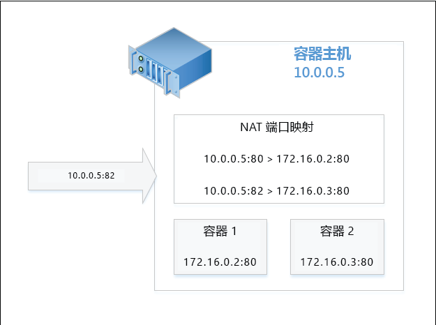

# 容器网络

**这是初步内容，可能还会更改。** 

关于网络，Windows 容器的作用类似于虚拟机。 每个容器都有一个连接到虚拟交换机的虚拟网络适配器，通过该适配器可转发入站和出站流量。 为了强制隔离同一主机上的各容器，将为每个 Windows Server 和 Hyper-V 容器创建网络隔离舱，将该容器的网络适配器安装在其中。 Windows Server 容器使用主机 vNIC 连接到虚拟交换机。 Hyper-V 容器使用合成 VM NIC（不公开到实用工具 VM）连接到虚拟交换机。

Windows 容器支持四种不同的网络模式。

- **网络地址转换模式** - 每个容器均连接到内部虚拟交换机，并且将使用 WinNAT 连接到专用 IP 子网。 WinNAT 将在容器主机和容器本身之间执行网络地址转换 (NAT) 和端口地址转换 (PAT)。

- **透明模式** - 每个容器均连接到外部虚拟交换机，并且将直接连接到物理网络。 可使用外部 DHCP 服务器静态或动态分配 IP。 原始容器网络流量帧将直接放在物理网络，不使用任何地址转换。

- **L2 桥接模式** - 每个容器均连接到外部虚拟交换机。 同一 IP 子网中两个容器间和连接到同一容器主机上的网络流量将直接进行桥接。 不同 IP 子网上两个容器间或连接到不同容器主机上的网络流量将通过外部虚拟交换机发送。 传出时，源于容器的网络流量会将源 MAC 地址重写为容器主机的地址。 传入时，发往容器的网络流量将把目标 MAC 地址重写为容器本身的地址。

- **L2 隧道模式** - *（这种模式应只用于 Microsoft 云堆栈）*。 与 L2 桥接模式相似，每个容器均连接到外部虚拟交换机，且在传出和传入时重写 MAC 地址。 但是，所有容器网络流量都转发到物理主机的虚拟交换机，而不考虑第 2 层连接。 这样，网络策略能够在物理主机的虚拟交换机中得到执行，例如通过更高级别的网络堆栈（如网络控制器或网络资源提供程序）进行编程。

本文档将详细介绍每种模式的优点和配置。

## 创建网络

### 概述

可以使用 PowerShell 或 Docker 创建容器网络，将容器连接到网络，以及设置端口转发规则。 在未来，重点将放在基于 Docker 云网络模型 (CNM) 的 Docker 命令。

Docker 网络创建的可接受驱动程序列表是“透明”、“nat”和“l2bridge”。 如前所述，L2 隧道驱动程序应只用于 Microsoft Azure 公共云部署方案。 

> Docker 网络驱动程序为全部小写。

Docker 后台程序通过用来创建网络的驱动程序名称来指示不同的网络模式。 例如，NAT 网络模式具有相应的名为 nat 的 Docker 网络驱动程序。 默认情况下，Windows 上的 Docker 引擎将查找具有 nat 驱动程序的网络。 如果 NAT 网络不存在，Docker 引擎将创建一个。 默认情况下，创建的所有容器都将连接到 nat 网络。

启动 Docker 后台程序引擎时，通过指定名为“none”的特定“网桥”（使用 -b none 选项）可以替代此行为（默认情况下使用 NAT 网络驱动程序）。

若要停止该服务，请运行以下 PowerShell 命令。

```none
Stop-Service docker
```

可在 `c:\programdata\docker\runDockerDaemon.cmd` 找到配置文件。 添加以下行，并添加 `-b "none"`

```none
dockerd -b "none"
```

重新启动服务。

```none
Start-Service docker
```

通过“-b none”运行 Docker 后台程序时，将需要在容器创建/启动期间创建和引用特定网络。

若要列出主机上可用的容器网络，请使用以下 Docker 或 PowerShell 命令。

```none
docker network ls
```
输出的内容将类似于：

```none
NETWORK ID          NAME                DRIVER
bd8b691a8286        nat                 nat
7b055c7ed373        none                null
```
或使用 PowerShell 的等效项：


```none
Get-ContainerNetwork |fl
```

输出的内容将类似于：

```none
Name               : nat
SubnetPrefix       : {172.16.0.0/12}
Gateways           : {172.16.0.1}
Id                 : 67ea1851-326d-408b-a5ef-7dcdb15c4438
Mode               : NAT
NetworkAdapterName :
SourceMac          :
DNSServers         : {10.222.118.22, 10.221.228.12, 10.222.114.67}
DNSSuffix          : corp.microsoft.com
IsDeleted          : False
```

> 在 PowerShell 中，网络模式名称不区分大小写。


### NAT 网络

**网络地址转换** - 此网络模式对快速将专用 IP 地址分配到容器很有用。 通过在外部 IP 地址和端口（容器主机）间、内部 IP 地址和容器端口间映射端口来提供对容器的外部访问。 外部 IP 地址/端口组合上接收的所有网络流量可比作 WinNAT 端口映射表，并转发到正确的容器 IP 地址和端口。 此外，NAT 允许多个容器托管可能需要相同（内部）通信端口的应用程序，方法是将它们映射到唯一的外部端口。 在 TP5 中，只有一个 NAT 网络可以存在。

> 在 TP5 中，防火墙规则将为所有 NAT 静态端口映射自动创建。 此防火墙规则将适用于容器主机，而非特定于特定容器终结点或网络适配器。

#### 主机配置 <!--1-->

若要使用 NAT 网络模式，使用驱动程序名称“nat”创建容器网络。

```none
docker network create -d nat MyNatNetwork
```

网关 IP 地址 (--gateway=<string[]>) 和子网前缀 (--subnet=<string[]>) 等其他参数可添加到 Docker 网络创建命令。 参阅下面内容了解其他详细信息。

若要使用 PowerShell 创建 NAT 网络，可以使用以下语法。 请注意，可以使用 PowerShell 指定其他参数（包括 DNSServers 和 DNSSuffix）。 如未指定，将从容器主机继承这些设置。

```none
New-ContainerNetwork -Name MyNatNetwork -Mode NAT -SubnetPrefix "172.16.0.0/12" [-GatewayAddress <address>] [-DNSServers <address>] [-DNSSuffix <string>]
```

### 透明网络

**透明网络** - 此网络模式应只用于非常小的部署中，其中要求容器和物理网络之间进行直接连接。 在此配置中，运行在容器中的所有网络服务都可从物理网络直接访问。 IP 地址可以静态方式进行分配，假定它们位于物理网络的 IP 子网前缀内，并且不会与物理网络上其他 IP 冲突。 IP 地址还可从物理网络上外部 DHCP 服务器以动态方式进行分配。 如果 DHCP 未用于 IP 分配，可以指定一个网关 IP 地址。 

#### 主机配置 <!--2-->

若要使用透明网络模式，使用驱动程序名称“透明”创建容器网络。 

```none
docker network create -d transparent MyTransparentNetwork
```

在此示例中，透明网络正被创建并分配网关。

```none
docker network create -d transparent --gateway=10.50.34.1 "MyTransparentNet"
```

PowerShell 命令将类似如下：

```none
New-ContainerNetwork -Name MyTransparentNet -Mode Transparent -NetworkAdapterName "Ethernet"
```

如果容器主机被虚拟化，而你想要使用 DHCP 进行 IP 分配，则必须在虚拟机网络适配器上启用 MACAddressSpoofing。

```none
Get-VMNetworkAdapter -VMName ContainerHostVM | Set-VMNetworkAdapter -MacAddressSpoofing On
```

### L2 桥接网络

**L2 桥接网络** - 在此配置中，容器主机中的虚拟筛选平台 (VFP) vSwitch 扩展将充当网桥并根据需要执行第 2 层地址转换（重新编写 MAC 地址）。 第 3 层 IP 地址和第 4 层端口将保持不变。 可以静态方式分配 IP 地址从而与物理网络的 IP 子网前缀对应，或者如果使用 Microsoft 私有云部署，则与虚拟网络子网前缀的 IP 对应。

#### 主机配置 <!--3-->

若要使用 L2 桥接网络模式，使用驱动程序名称“l2bridge”创建容器网络。 创建 L2Bridge 网络时还必须指定子网和网关。

```none
docker network create -d l2bridge --subnet=192.168.1.0/24 --gateway=192.168.1.1 MyBridgeNetwork
```

PowerShell 命令将类似如下：

```none
New-ContainerNetwork -Name MyBridgeNetwork -Mode L2Bridge -NetworkAdapterName "Ethernet"
```

## 删除网络

使用 `docker network rm` 删除容器网络。

```none
docker network rm "<network name>"
```
或者通过 PowerShell 使用 `Remove-ContainerNetwork`：

通过 PowerShell
```
Remove-ContainerNetwork -Name <network name>
```

这将清除容器网络所用的所有 Hyper-V 虚拟交换机，以及为 nat 容器网络创建的所有网络地址转换对象。

## 网络选项

创建容器网络或容器本身时，可以指定不同的 Docker 网络选项。 此外，使用 -d (--driver=<network mode>) 选项来指定网络模式，创建容器网络时还可支持 --gateway、--subnet 和 -o 选项。

### 其他选项

可以使用 `--gateway` 指定网关 IP 地址。 只有使用以静态方式进行的 IP 分配（透明网络）时才可实现。

```none
docker network create -d transparent --gateway=10.50.34.1 "MyTransparentNet"
```

使用 `--subnet` 可以指定 IP 子网前缀，将控制从其分配 IP 地址的网络段。

```none
docker network create -d nat --subnet=192.168.0.0/24 "MyCustomNatNetwork"
```
可通过 Docker 使用 -o (--opt=map[]) 参数进行对容器网络的其他自定义。 

若要指定透明、L2Bridge 或 L2 隧道网络将使用容器主机中的哪个网络适配器，请指定 *com.docker.network.windowsshim.interface* 选项。 
```none
docker network create -d transparent -o com.docker.network.windowsshim.interface="Ethernet 2" "TransparentNetTwo"
```

> 通过 PowerShell 创建的容器网络在 Docker 中将不可用，直到重新启动 Docker 后台程序。 通过 PowerShell 对容器网络做的任何其他更改也要求重新启动 Docker 后台程序。

### 多个容器网络

多个容器网络可在单个容器主机上进行创建，但注意以下内容：
* 每个容器主机只可创建一个 NAT 网络。
* 每个使用外部 vSwitch 进行连接的多个网络（例如透明、L2 桥接、L2 透明）必须使用其自身的网络适配器。
* 不同的网络必须使用不同的 vSwitch。

### 网络选择

创建 Windows 容器时，可以指定容器网络适配器将连接到的网络。 如果不指定任何网络，则将使用默认的 NAT 网络。

若要将容器连接到非默认的 NAT 网络（或 -b none 正在使用中），则使用 --net 选项与 Docker 运行命令。

```none
docker run -it --net=MyTransparentNet windowsservercore cmd
```

### 静态 IP 地址

静态 IP 地址在容器网络适配器上设置，并且仅支持 NAT、透明和 L2Bridge 网络模式。 此外，静态 IP 分配不支持通过 Docker 的默认“nat”网络。

```none
docker run -it --net=MyTransparentNet --ip=10.80.123.32 windowsservercore cmd
```

静态 IP 分配直接在容器的网络适配器上执行，并且必须仅当容器处于已停止状态时执行。 容器运行时，不支持“热添加”容器网络适配器或更改网络堆栈。

```none
Get-ContainerNetworkAdapter -ContainerName "DemoNAT"

ContainerName Name            Network Id                           Static MacAddress Static IPAddress Maximum Bandwidth
------------- ----            ----------                           ----------------- ---------------- -----------------
DemoNAT       Network Adapter C475D31C-FB42-408E-8493-6DB6C9586915                              0

Set-ContainerNetworkAdapter -ContainerName "DemoNAT" -StaticIPAddress 172.16.0.100
```

相反，如果希望从容器网络子网前缀指定的范围中自动选择 IP 地址，则启动容器而不将任何设置应用于容器网络适配器。

> 通过 PowerShell 进行的静态 IP 地址分配在连接到透明网络的容器终结点上将无法工作。

若要查看哪些容器连接到特定网络和与这些容器终结点相关联的 IP，可以运行以下命令。

```none
docker network inspect nat
```

### 创建 MAC 地址

可使用 `--mac-address` 选项来指定 MAC 地址。

```none
docker run -it --mac="92:d0:c6:0a:29:33" --name="MyContainer" windowsservercore cmd
```

### 端口映射

若要访问连接到 NAT 网络的容器内部的应用程序，需要在容器主机和容器网络适配器之间创建端口映射。 这些映射必须在容器处于已停止状态时进行创建。

此示例将创建容器主机的端口 **80** 到容器的端口 **80** 之间的静态映射。

```none
docker run -it --name=DemoNat -p 80:80 windowsservercore cmd
```

此示例将创建容器主机的端口 **8082** 到容器的端口 **80** 之间的静态映射。

```none
docker run -it --name=DemoNat -p 8082:80 windowsservercore cmd
```

动态端口映射也通过 Docker 受到支持，因此用户无需从从容器主机指定特定端口进行映射。 将在容器主机上选择一个随机选择的临时端口，并在运行 Docker ps 时进行检查。

```none
docker run -itd --name=DemoNat -p 80 windowsservercore cmd

docker ps
CONTAINER ID        IMAGE               COMMAND             CREATED             STATUS              PORTS                   NAMES
bbf72109b1fc        windowsservercore   "cmd"               6 seconds ago       Up 2 seconds        *0.0.0.0:14824->80/tcp*   DemoNat
```

在此示例中，DemoNat 容器的 TCP 端口 80 将从端口 14824 上的容器主机中从外部进行公开。

在创建端口映射后，可通过容器主机（物理或虚拟）的 IP 地址和公开的外部端口访问容器应用程序。 例如，下图描述了 NAT 配置，具有面向容器主机的外部端口 **82** 的请求。 根据端口映射，此请求将返回在容器 2 中托管的应用程序。



来自 Internet 浏览器的请求视图。


## 注意事项和陷阱

### 防火墙

容器主机需要创建特定防火墙规则用于启用 ICMP (Ping) 和 DHCP。 Windows Server 容器需要 ICMP 和 DHCP 以在同一主机上两个容器之间进行 ping 操作，以及接收通过 DHCP 动态分配的 IP 地址。 在 TP5 中，这些规则将通过 Install-ContainerHost.ps1 脚本进行创建。 TP5 之后，这些规则将自动创建。 NAT 端口转发规则所对应的所有防火墙规则将自动创建，并在容器停止后清除。

### 不支持的功能

以下网络功能现无法通过 Docker CLI 受到支持
 * 容器链接（例如 --link）
 * 容器的基于名称的 IP 解析

以下网络选项在 Windows Docker 上现不受支持：
 * --add-host
 * --dns
 * --dns-opt
 * --dns-search
 * -h，--hostname
 * --net-alias
 * --aux-address
 * --internal
 * --ip-range

<!--HONumber=May16_HO3-->


