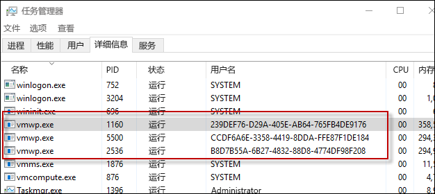

# Hyper-V 容器

**这是初步内容，可能还会更改。**

Windows 容器技术包括两种不同类型的容器，即 Windows Server 容器和 Hyper-V 容器。 这两种类型的容器的创建、管理和功能完全相同。 它们甚至会生成和使用相同的容器映像。 它们之间的不同之处是在容器、主机操作系统以及在该主机上运行的所有其他容器之间创建的隔离级别。

Windows Server 容器 - 使用通过命名空间、资源控制和进程隔离技术提供的隔离，可以在主机上同时运行多个容器实例。 Windows Server 容器可以与主机彼此共享相同的内核。

Hyper-V 容器 – 多个容器实例可以在主机上同时运行；但是，每个容器均在特殊的虚拟机内部运行。 这在每个 Hyper-V 容器和容器主机之间提供内核级隔离。

## Hyper-V 容器 PowerShell

### 创建容器

Hyper-V 容器与 Widows Server 容器的创建相同，唯一的区别是指示其是否为 Hyper-V 容器的 Runtime 参数。

使用 PowerShell 创建 Hyper-V 容器的示例

```powershell
PS C:\> $con = New-Container -Name HYPVCON -ContainerImageName NanoServer -SwitchName "Virtual Switch" -RuntimeType HyperV
```

### 转换容器

除了在生成时可以将容器创建为 Hyper-V 容器之外，使用 PowerShell 创建的容器还可以从 Windows Server 容器转换为 Hyper-V 容器。

> 当前唯一支持容器运行时转换的主机操作系统是 Nano Server。

使用默认运行时创建新容器。

```powershell
PS C:\> New-Container -Name DEMO -ContainerImageName nanoserver -SwitchName NAT
```
从容器返回运行时属性，同时请注意，运行时将设置为默认值。

```powershell
PS C:\> Get-Container | Select ContainerName, RuntimeType

ContainerName RuntimeType
------------- -----------
DEMO              Default
```

使用 `set-container` 命令来更改容器运行时。

```powershell
PS C:\> Set-Container $con -RuntimeType HyperV
```

最后，再次返回运行时属性以查看更改。

```powershell
PS C:\> Get-Container | select ContainerName, RuntimeType

ContainerName RuntimeType
------------- -----------
DEMO               HyperV
```

## Hyper-V 容器 Docker

### 创建容器

使用 Docker 管理 Hyper-V 容器与管理 Windows Server 容器几乎相同。 当使用 Docker 创建 Hyper-V 容器时，将使用 `–-isolation=hyperv` 参数。

```powershell
docker run -it --isolation=hyperv 646d6317b02f cmd
```

## 内部结构

### VM 工作进程

对于创建的每个 Hyper-V 容器，将创建相应的虚拟机工作进程。

```powershell
PS C:\> Get-Container | Select Name, RuntimeType, ContainerID | Where {$_.RuntimeType -eq 'Hyperv'}

Name RuntimeType ContainerId
---- ----------- -----------
TST3      HyperV 239def76-d29a-405e-ab64-765fb4de9176
TST       HyperV b8d7b55a-6b27-4832-88d8-4774df98f208
TST2      HyperV ccdf6a6e-3358-4419-8dda-ffe87f1de184
```

请注意，通过容器 ID 和进程用户名，可以将容器与进程相匹配。



使用 `Get-ComputeProcess` 命令也可以查看这种关系。

```powershell
PS C:\> Get-ComputeProcess

Id                                   Name Owner      Type
--                                   ---- -----      ----
239DEF76-D29A-405E-AB64-765FB4DE9176 TST3 VMMS  Container
B8D7B55A-6B27-4832-88D8-4774DF98F208 TST  VMMS  Container
CCDF6A6E-3358-4419-8DDA-FFE87F1DE184 TST2 VMMS  Container
```

有关 `Get-ComputeProcess` 命令的详细信息，请参阅[管理互操作性](./hcs_powershell.md)。

## 隔离演示

### Windows Server 容器

可以使用以下练习来演示 Hyper-V 容器的隔离。 在本练习中，将同时创建 Windows Server 和 Hyper-V 容器。 将对容器主机上正在运行的进程进行检查并显示如何在容器主机上共享 Windows Server 容器进程，但无法共享 Hyper-V 容器进程。

```powershell
PS C:\> get-process | where {$_.ProcessName -eq 'csrss'}

Handles  NPM(K)    PM(K)      WS(K) VM(M)   CPU(s)     Id  SI ProcessName
-------  ------    -----      ----- -----   ------     --  -- -----------
    255      12     1820       4000 ...98     0.53    532   0 csrss
    116      11     1284       3700 ...94     0.25    608   1 csrss
    246      13     1844       5504 ...17     3.45   3484   2 csrss
```

创建新的 Windows Server 容器：

```powershell
PS C:\> New-Container -Name WINCONT -ContainerImageName WindowsServerCore -SwitchName "Virtual Switch"
```

启动该容器：

```powershell
PS C:\> Start-Container $con
```

创建与该容器的远程 PS 会话。

```powershell
PS C:\> Enter-PSSession -ContainerId $con.ContainerId –RunAsAdministrator
```

从远程容器会话中，返回进程名称为 csrss 的所有进程。 记下正在运行的 csrss 进程的进程 ID（在下面的示例中为 1228）。

```powershell
[WINCONT]: PS C:\> get-process | where {$_.ProcessName -eq 'csrss'}

Handles  NPM(K)    PM(K)      WS(K) VM(M)   CPU(s)     Id  SI ProcessName
-------  ------    -----      ----- -----   ------     --  -- -----------
    167       9     1276       3720 ...97     0.20   1228   3 csrss
```

现在从容器主机返回 csrss 进程的列表。 请注意，相同的 csrss 进程也会从该容器主机返回。

```powershell
PS C:\> get-process | where {$_.ProcessName -eq 'csrss'}

Handles  NPM(K)    PM(K)      WS(K) VM(M)   CPU(s)     Id  SI ProcessName
-------  ------    -----      ----- -----   ------     --  -- -----------
    252      11     1712       3968 ...98     0.53    532   0 csrss
    113      11     1176       3676 ...93     0.25    608   1 csrss
    175       9     1260       3708 ...97     0.20   1228   3 csrss
    243      13     1736       5512 ...17     3.77   3484   2 csrss
```
### Hyper-V 容器

从容器主机返回 csrss 进程的列表。

```powershell
PS C:\> get-process | where {$_.ProcessName -eq 'csrss'}

Handles  NPM(K)    PM(K)      WS(K) VM(M)   CPU(s)     Id  SI ProcessName
-------  ------    -----      ----- -----   ------     --  -- -----------
    261      12     1820       4004 ...98     0.53    532   0 csrss
    116      11     1284       3704 ...94     0.25    608   1 csrss
    246      13     1844       5536 ...17     3.83   3484   2 csrss
```

现在，创建 Hyper-V 容器。

```powershell
PS C:\> $con = New-Container -Name HYPVCON -ContainerImageName NanoServer -SwitchName "Virtual Switch" -RuntimeType HyperV
```

启动 Hyper-V 容器

```powershell
PS C:\> Start-Container $con
```

创建与 Hyper-V 容器的远程 PS 会话。

```powershell
PS C:\> Enter-PSSession -ContainerId $con.ContainerId –RunAsAdministrator
```

返回在 Hyper-V 容器内部运行的 csrss 进程的列表。 记下 csrss 进程的进程 ID（在下面示例中为 956）。

```powershell
[HYPVCON]: PS C:\> get-process | where {$_.ProcessName -eq 'csrss'}

Handles  NPM(K)    PM(K)      WS(K) VM(M)   CPU(s)     Id  SI ProcessName
-------  ------    -----      ----- -----   ------     --  -- -----------
              4      452       1520 ...63     0.06    956   1 csrss
```

现在，在容器主机上返回 csrss 进程的列表。 请注意，与 Windows Server 容器不同（在该容器中，csrss 进程在容器内部和容器主机中都可见），Hyper-V 容器进程仅在该容器本身内可见。 这是因为 Hyper-V 容器封装在实用工具虚拟机中，而且该进程仅与此实用工具虚拟机隔离。

```powershell
PS C:\> get-process | where {$_.ProcessName -eq 'csrss'}

Handles  NPM(K)    PM(K)      WS(K) VM(M)   CPU(s)     Id  SI ProcessName
-------  ------    -----      ----- -----   ------     --  -- -----------
    255      12     1716       3972 ...98     0.56    532   0 csrss
    113      11     1176       3676 ...93     0.25    608   1 csrss
    243      13     1732       5512 ...18     4.23   3484   2 csrss
```

## 视频演练

<iframe src="https://channel9.msdn.com/Blogs/containers/Container-Fundamentals--Part-5-Hyper-V-Containers/player#ccLang=zh-cn" width="800" height="450"  allowFullScreen="true" frameBorder="0" scrolling="no"></iframe>


<!--HONumber=Feb16_HO2-->
