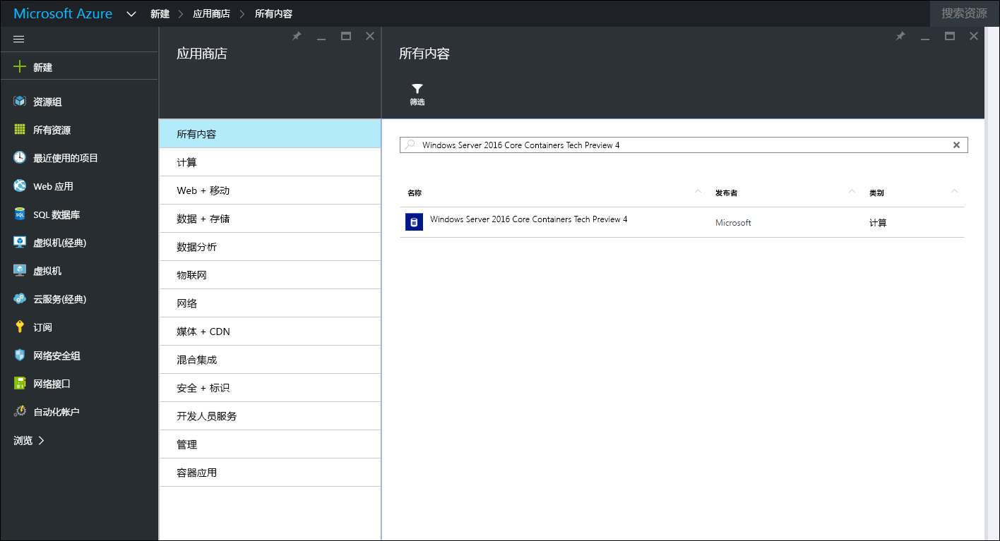
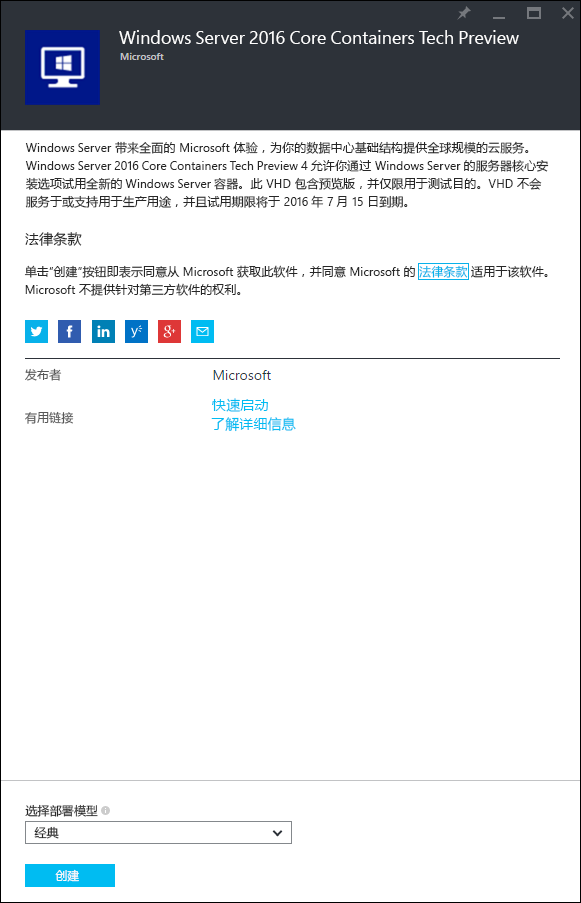
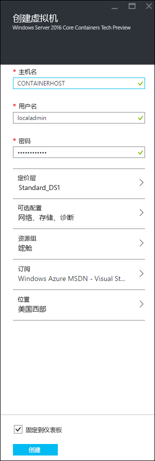
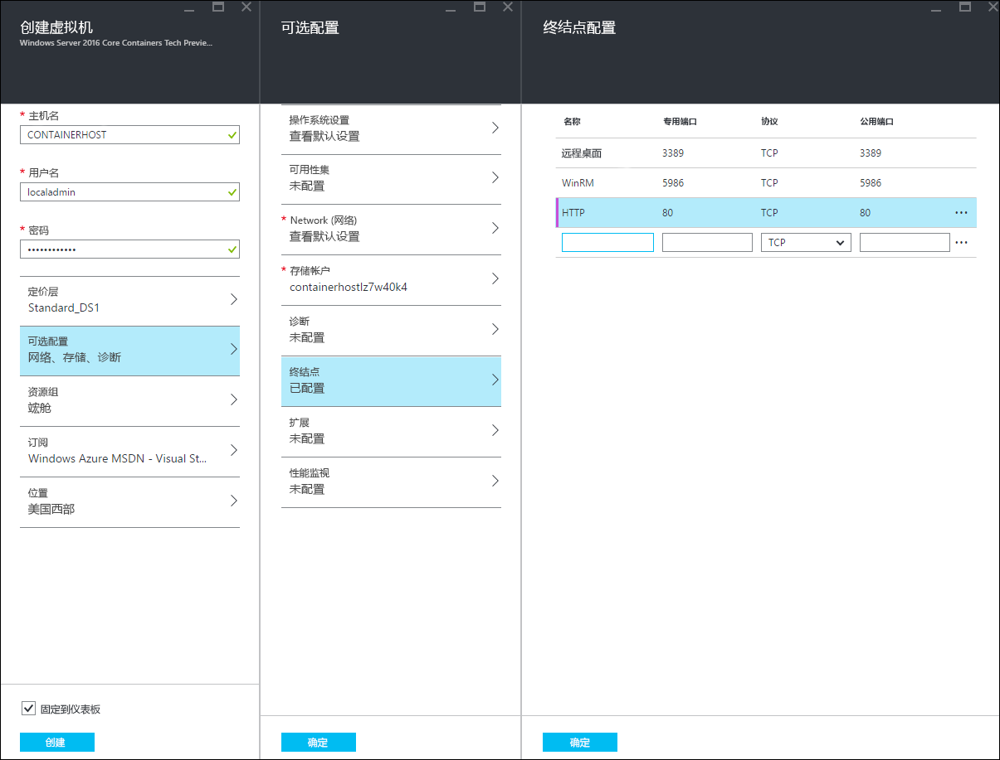
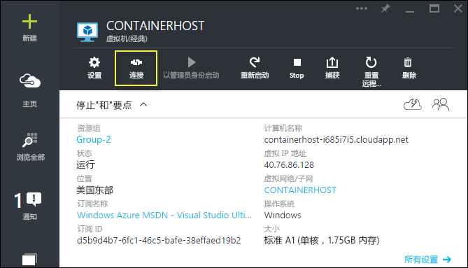
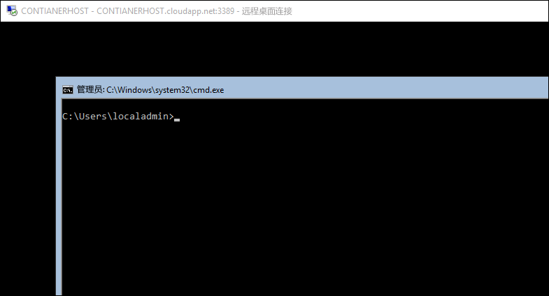

# Azure 快速入门

在 Azure 中创建和管理 Windows Server 容器前，你需要部署 Windows Server 2016 Technical Preview 映像，该映像已使用 Windows Server 容器功能进行预配置。 本指南向你演练此过程。

> Microsoft Azure 不支持 Hyper-V 容器。 若要完成 Hyper-V 容器练习，你需要本地容器主机。

## 开始使用 Azure 门户

如果你有 Azure 帐户，请跳到[创建容器主机 VM](#CreateacontainerhostVM)。

1. 转到 [azure.com](https://azure.com)，然后按照 [Azure 免费试用版](https://azure.microsoft.com/en-us/pricing/free-trial/)的步骤进行操作。
2. 使用你的 Microsoft 帐户登录。
3. 当你的帐户准备就绪时，登录 [Azure 管理门户](https://portal.azure.com)。

## 创建容器主机 VM

在 Azure 应用商店中搜索“containers”，这将返回“Windows Server 2016 Core Containers Tech Preview 4”

选择该映像，然后单击“创建”``。

为虚拟机命名，选择用户名和密码。

依次选择“可选配置”>“终结点”> 然后输入专用和公用端口为 80 的 HTTP 终结点，如下所示。 完成后，单击“确定”两次。

选择“创建”``按钮来启动虚拟机部署过程。

当 VM 部署完成时，请选择“连接”按钮来启动与 Windows Server 容器主机的 RDP 会话。

使用在 VM 创建期间指定的用户名和密码登录 VM。 登录后，你将看到 Windows 命令提示符。

## 视频演练

<iframe src="https://channel9.msdn.com/Blogs/containers/Quick-Start-Configure-Windows-Server-Containers-in-Microsoft-Azure/player#ccLang=zh-cn" width="800" height="450"  allowFullScreen="true" frameBorder="0" scrolling="no"></iframe>

## 后续步骤：开始使用容器

现在你有运行 Windows Server 容器功能的 Windows Server 2016 系统，请跳到以下指南来开始使用 Windows Server 容器和 Windows Server 容器映像。

[快速入门：Windows 容器和 Docker](./manage_docker.md)  
[快速入门：Windows 容器和 PowerShell](./manage_powershell.md)

<!--HONumber=Feb16_HO1-->
