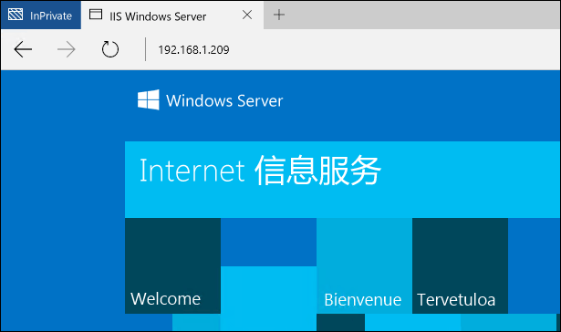
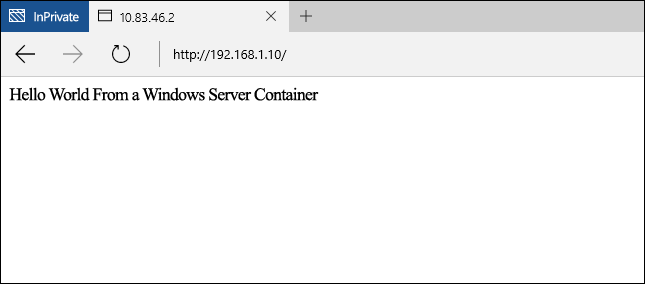

# Windows 容器快速入门 - PowerShell

Windows 容器可用于在单个计算机系统上快速部署多个独立应用程序。 本快速入门演示了如何使用 PowerShell 部署和管理 Windows Server 和 Hyper-V 容器。 在本练习中，你将从头开始生成一个非常简单的“Hello World”应用程序，该应用程序可在 Windows Server 和 Hyper-V 容器中运行。 在此过程中，你将创建容器映像、使用容器共享文件夹和管理容器生命周期。 完成该过程后，你将基本了解 Windows 容器的部署和管理。

本演练详细介绍了 Windows Server 容器和 Hyper-V 容器。 每种类型的容器都有其自己的基本要求。 Windows 容器文档中包含了快速部署容器主机的过程。 这是 Windows 容器快速入门的最简单方法。 如果你还没有容器主机，请参阅[容器主机部署快速入门](./container_setup.md)。

每个练习都需要以下项目。

**Windows Server 容器：**

- 在本地或 Azure 中运行 Windows Server 2016 Core 的 Windows 容器主机。

**Hyper-V 容器：**

- 通过嵌套虚拟化启用的 Windows 容器主机。
- Windows Server 2016 媒体 - [下载](https://aka.ms/tp4/serveriso)。

> Microsoft Azure 不支持 Hyper-V 容器。 若要完成 Hyper-V 练习，你需要本地容器主机。

## Windows Server 容器

Windows Server 容器提供一个独立的可移植并且受资源控制的操作环境，用于运行应用程序和托管进程。 Windows Server 容器通过进程和命名空间的隔离，提供了容器和主机之间以及在主机上运行的容器之间的隔离。

### 创建容器

使用 TP4 时，在 Windows Server 2016 或 Windows Server 2016 Core 上运行的 Windows Server 容器需要 Windows Server 2016 Core 操作系统映像。

通过键入 `powershell` 启动 PowerShell 会话。

```powershell
C:\> powershell
Windows PowerShell
Copyright (C) 2015 Microsoft Corporation. All rights reserved.

PS C:\>
```

若要验证是否已安装 Windows Server Core 操作系统映像，请使用 `Get-ContainerImage` 命令。 你可能会看到多个操作系统映像，这是正常现象。

```powershell
PS C:\> Get-ContainerImage

Name              Publisher    Version      IsOSImage
----              ---------    -------      ---------
NanoServer        CN=Microsoft 10.0.10586.0 True
WindowsServerCore CN=Microsoft 10.0.10586.0 True
```

若要创建 Windows Server 容器，请使用 `New-Container` 命令。 下面的示例从 `WindowsServerCore` 操作系统映像创建一个名为 `TP4Demo` 的容器，并将该容器连接到名为 `Virtual Switch` 的 VM 交换机。

```powershell
PS C:\> New-Container -Name TP4Demo -ContainerImageName WindowsServerCore -SwitchName "Virtual Switch"

Name    State Uptime   ParentImageName
----    ----- ------   ---------------
TP4Demo Off   00:00:00 WindowsServerCore
```

若要可视化现有容器，请使用 `Get-Container` 命令。

```powershell
PS C:\> Get-Container

Name    State Uptime   ParentImageName
----    ----- ------   ---------------
TP4Demo Off   00:00:00 WindowsServerCore
```

使用 `Start-Container` 命令启动该容器。

```powershell
PS C:\> Start-Container -Name TP4Demo
```

使用 `Enter-PSSession` 命令连接到该容器。 请注意，在创建与容器的 PowerShell 会话时，PowerShell 提示用于反映容器名称的更改。

```powershell
PS C:\> Enter-PSSession -ContainerName TP4Demo -RunAsAdministrator

[TP4Demo]: PS C:\Windows\system32>
```

### 创建 IIS 映像

现在可以修改此容器，并捕获这些修改来创建一个新的容器映像。 在本示例中，已安装 IIS。

若要在容器中安装 IIS 角色，请使用 `Install-WindowsFeature` 命令。

```powershell
[TP4Demo]: PS C:\> Install-WindowsFeature web-server

Success Restart Needed Exit Code      Feature Result
------- -------------- ---------      --------------
True    No             Success        {Common HTTP Features, Default Document, D...
```

IIS 安装完成后，请通过键入 `exit` 退出容器。 这会将 PowerShell 会话返回到容器主机的会话。

```powershell
[TP4Demo]: PS C:\> exit
PS C:\>
```

最后，使用 `Stop-Container` 命令停止该容器。

```powershell
PS C:\> Stop-Container -Name TP4Demo
```

现在可以将此容器的状态捕获到新的容器映像中。 使用 `New-ContainerImage` 命令执行此操作。

本示例创建一个名为 `WindowsServerCoreIIS` 的新容器映像，其发布者为 `Demo`，版本为 `1.0`。

```powershell
PS C:\> New-ContainerImage -ContainerName TP4Demo -Name WindowsServerCoreIIS -Publisher Demo -Version 1.0

Name                 Publisher Version IsOSImage
----                 --------- ------- ---------
WindowsServerCoreIIS CN=Demo   1.0.0.0 False
```

现在，容器已被捕获到新的映像，不再需要该容器。 你可以使用 `Remove-Container` 命令删除它。

```powershell
PS C:\> Remove-Container -Name TP4Demo -Force
```


### 创建 IIS 容器

此时从 `WindowsServerCoreIIS` 容器映像创建新容器。

```powershell
PS C:\> New-Container -Name IIS -ContainerImageName WindowsServerCoreIIS -SwitchName "Virtual Switch"

Name State Uptime   ParentImageName
---- ----- ------   ---------------
IIS  Off   00:00:00 WindowsServerCoreIIS
```
启动容器。

```powershell
PS C:\> Start-Container -Name IIS
```

### 配置网络

Windows 容器快速入门的默认网络配置是将容器连接到使用网络地址转换 (NAT) 配置的虚拟交换机。 因此，为了连接到在容器内部运行的应用程序，需要将容器主机上的某个端口映射到容器上的某个端口。 有关容器网络的详细信息，请参阅[容器网络](../management/container_networking.md)。

对于本练习，网站在 IIS 中托管，并在容器内部运行。 若要访问端口 80 上的网站，请将容器主机 IP 地址的端口 80 映射到容器 IP 地址的端口 80。

运行以下内容以返回容器的 IP 地址。

```powershell
PS C:\> Invoke-Command -ContainerName IIS {ipconfig}

Windows IP Configuration


Ethernet adapter vEthernet (Virtual Switch-7570F6B1-E1CA-41F1-B47D-F3CA73121654-0):

   Connection-specific DNS Suffix  . : DNS
   Link-local IPv6 Address . . . . . : fe80::ed23:c1c6:310a:5c10%16
   IPv4 Address. . . . . . . . . . . : 172.16.0.2
   Subnet Mask . . . . . . . . . . . : 255.255.255.0
   Default Gateway . . . . . . . . . : 172.16.0.1
```

若要创建 NAT 端口映射，请使用 `Add-NetNatStaticMapping` 命令。 以下示例将检查现有的端口映射规则，如果不存在规则，则创建一个规则。 请注意，`-InternalIPAddress` 需要与容器的 IP 地址相匹配。

```powershell
if (!(Get-NetNatStaticMapping | where {$_.ExternalPort -eq 80})) {
Add-NetNatStaticMapping -NatName "ContainerNat" -Protocol TCP -ExternalIPAddress 0.0.0.0 -InternalIPAddress 172.16.0.2 -InternalPort 80 -ExternalPort 80
}
```

创建端口映射时，你还需要为配置的端口配置一个入站防火墙规则。 若要为端口 80 执行此操作，请运行以下脚本。 请注意，如果你已为 80 除外的外部端口创建 NAT 规则，则需要创建该防火墙规则以进行匹配。

```powershell
if (!(Get-NetFirewallRule | where {$_.Name -eq "TCP80"})) {
    New-NetFirewallRule -Name "TCP80" -DisplayName "HTTP on TCP/80" -Protocol tcp -LocalPort 80 -Action Allow -Enabled True
}
```

如果你正在 Azure 中工作，并且尚未创建网络安全组，则需要立即创建一个网络安全组。 有关网络安全组的详细信息，请参阅文章：[什么是网络安全组](https://azure.microsoft.com/en-us/documentation/articles/virtual-networks-nsg/)。

### 创建应用程序

现在已从 IIS 映像创建一个容器并已配置网络，请打开浏览器并浏览到容器主机的 IP 地址。 你应该可以看到 IIS 初始屏幕。



经过验证，IIS 实例正在运行，你可以立即创建“Hello World”应用程序，并在 IIS 实例中托管它。 若要执行此操作，请创建与该容器的 PowerShell 会话。

```powershell
PS C:\> Enter-PSSession -ContainerName IIS -RunAsAdministrator
[IIS]: PS C:\Windows\system32>
```

运行以下命令来删除 IIS 初始屏幕。

```powershell
[IIS]: PS C:\> del C:\inetpub\wwwroot\iisstart.htm
```
运行以下命令来将默认 IIS 站点替换为新的静态站点。

```powershell
[IIS]: PS C:\> "Hello World From a Windows Server Container" > C:\inetpub\wwwroot\index.html
```

再次浏览到容器主机的 IP 地址，你现在应该可以看到“Hello World”应用程序。 请注意，为了查看更新的应用程序，你可能需要关闭任何现有浏览器连接或清除浏览器缓存。



退出远程容器会话。

```powershell
[IIS]: PS C:\> exit
PS C:\>
```

### 删除容器

在删除容器之前，需要将其停止。

```powershell
PS C:\> Stop-Container -Name IIS
```

停止容器后，可以使用 `Remove-Container` 命令将其删除。

```powershell
PS C:\> Remove-Container -Name IIS -Force
```

最后，可以使用 `Remove-ContainerImage` 命令删除容器映像。

```powershell
PS C:\> Remove-ContainerImage -Name WindowsServerCoreIIS -Force
```

## Hyper-V 容器

Hyper-V 容器通过 Windows Server 容器提供额外的隔离层。 每个 Hyper-V 容器都在高度优化的虚拟机中创建。 如果 Windows Server 容器与容器主机以及在该主机上运行的所有其他 Windows Server 容器共享内核，Hyper-V 容器将完全与其他容器隔离。 Hyper-V 容器的创建和管理方式与 Windows Server 容器相同。 有关 Hyper-V 容器的详细信息，请参阅[管理 Hyper-V 容器](../management/hyperv_container.md)。

> Microsoft Azure 不支持 Hyper-V 容器。 若要完成 Hyper-V 容器练习，你需要本地容器主机。

### 创建容器

使用 TP4 时，Hyper-V 容器必须使用 Nano Server Core 操作系统映像。 若要验证是否已安装 Nano Server 操作系统映像，请使用 `Get-ContainerImage` 命令。

```powershell
PS C:\> Get-ContainerImage

Name              Publisher    Version      IsOSImage
----              ---------    -------      ---------
NanoServer        CN=Microsoft 10.0.10586.0 True
WindowsServerCore CN=Microsoft 10.0.10586.0 True
```

若要创建 Hyper-V 容器，请使用 `New-Container` 命令，从而指定 HyperV 的运行时。

```powershell
PS C:\> New-Container -Name HYPV -ContainerImageName NanoServer -SwitchName "Virtual Switch" -RuntimeType HyperV

Name State Uptime   ParentImageName
---- ----- ------   ---------------
HYPV Off   00:00:00 NanoServer
```

创建容器后，**不要启动它**。

### 创建共享文件夹

共享文件夹会向该容器显示容器主机中的目录。 创建共享文件夹后，在共享文件夹中放置的任何文件在该容器中都可用。 在本示例中，共享文件夹用于将 Nano Server IIS 程序包复制到该容器中。 然后，使用这些程序包安装 IIS。 有关共享文件夹的详细信息，请参阅[容器共享文件夹](../management/manage_data.md)。

在容器主机上创建一个名为 `c:\share\en-us` 的目录。

```powershell
S C:\> New-Item -Type Directory c:\share\en-us

    Directory: C:\share

Mode                LastWriteTime         Length Name
----                -------------         ------ ----
d-----       11/18/2015   5:27 PM                en-us
```

使用 `Add-ContainerSharedFolder` 命令在新容器上创建新的共享文件夹。

> 创建共享文件夹时，容器必须处于停止状态。

```powershell
PS C:\> Add-ContainerSharedFolder -ContainerName HYPV -SourcePath c:\share -DestinationPath c:\iisinstall

ContainerName SourcePath DestinationPath AccessMode
------------- ---------- --------------- ----------
HYPV          c:\share   c:\iisinstall   ReadWrite
```

创建共享文件夹后，启动该容器。

```powershell
PS C:\> Start-Container -Name HYPV
```
使用 `Enter-PSSession` 命令创建一个与该容器的 PowerShell 远程会话。

```powershell
PS C:\> Enter-PSSession -ContainerName HYPV -RunAsAdministrator
[HYPV]: PS C:\windows\system32\config\systemprofile\Documents>cd /
```
在进行远程会话时，请注意，虽然创建了共享文件夹 `c:\iisinstall\en-us`，但它是空文件夹。

```powershell
[HYPV]: PS C:\> ls c:\iisinstall

    Directory: C:\iisinstall

Mode                LastWriteTime         Length Name
----                -------------         ------ ----
d-----       11/18/2015   5:27 PM                en-us
```

### 创建 IIS 映像

由于容器要运行 Nano Server 操作系统映像，因此需要 Nano Server IIS 程序包才能安装 IIS。 这些程序包可以在 `NanoServer\Packages` 目录下的 Windows Sever 2016 TP4 安装媒体中找到。

将 `Microsoft-NanoServer-IIS-Package.cab` 从 `NanoServer\Packages` 复制到容器主机上的 `c:\share`。

将 `NanoServer\Packages\en-us\Microsoft-NanoServer-IIS-Package.cab` 复制到容器主机上的 `c:\share\en-us`。

在 c:\share 文件夹中，创建名为 unattend.xml 的文件，并将此文本复制到 unattend.xml 文件中。

```powershell
<?xml version="1.0" encoding="utf-8"?>
<unattend xmlns="urn:schemas-microsoft-com:unattend">
    <servicing>
        <package action="install">
            <assemblyIdentity name="Microsoft-NanoServer-IIS-Package" version="10.0.10586.0" processorArchitecture="amd64" publicKeyToken="31bf3856ad364e35" language="neutral" />
            <source location="c:\iisinstall\Microsoft-NanoServer-IIS-Package.cab" />
        </package>
        <package action="install">
            <assemblyIdentity name="Microsoft-NanoServer-IIS-Package" version="10.0.10586.0" processorArchitecture="amd64" publicKeyToken="31bf3856ad364e35" language="en-US" />
            <source location="c:\iisinstall\en-us\Microsoft-NanoServer-IIS-Package.cab" />
        </package>
    </servicing>
</unattend>
```

完成后，应对容器主机上的 `c:\share` 目录进行上述配置。

```
c:\share
|-- en-us
|    |-- Microsoft-NanoServer-IIS-Package.cab
|
|-- Microsoft-NanoServer-IIS-Package.cab
|-- unattend.xml
```

回到容器上的远程会话中，请注意，IIS 程序包和 unattended.xml 文件现已在 c:\iisinstall 目录中可见。

```powershell
[HYPV]: PS C:\> ls c:\iisinstall

    Directory: C:\iisinstall

Mode                LastWriteTime         Length Name
----                -------------         ------ ----
d-----       11/18/2015   5:32 PM                en-us
-a----       10/29/2015  11:51 PM        1922047 Microsoft-NanoServer-IIS-Package.cab
-a----       11/18/2015   5:31 PM            789 unattend.xml
```

运行以下命令来安装 IIS。

```powershell
[HYPV]: PS C:\> dism /online /apply-unattend:c:\iisinstall\unattend.xml

Deployment Image Servicing and Management tool
Version: 10.0.10586.0

Image Version: 10.0.10586.0


[                           1.0%                           ]

[=====                      10.1%                          ]

[=====                      10.3%                          ]

[===============            26.2%                          ]
```

完成 IIS 安装后，使用以下命令手动启动 IIS。

```powershell
[HYPV]: PS C:\> Net start w3svc
The World Wide Web Publishing Service service is starting.
The World Wide Web Publishing Service service was started successfully.
```

退出容器会话。

```powershell
[HYPV]: PS C:\> exit
```

停止容器。

```powershell
PS C:\> Stop-Container -Name HYPV
```

现在可以将此容器的状态捕获到新的容器映像中。

本示例创建一个名为 `NanoServerIIS` 的新容器映像，其中发布者为 `Demo`，版本为 `1.0`。

```powershell
PS C:\> New-ContainerImage -ContainerName HYPV -Name NanoServerIIS -Publisher Demo -Version 1.0

Name          Publisher Version IsOSImage
----          --------- ------- ---------
NanoServerIIS CN=Demo   1.0.0.0 False
```

### 创建 IIS 容器

使用 `New-Container` 命令从 IIS 映像创建新的 Hyper-V 容器。

```powershell
PS C:\> New-Container -Name IISApp -ContainerImageName NanoServerIIS -SwitchName "Virtual Switch" -RuntimeType HyperV

Name   State Uptime   ParentImageName
----   ----- ------   ---------------
IISApp Off   00:00:00 NanoServerIIS
```

启动容器。

```powershell
PS C:\> Start-Container -Name IISApp
```

### 配置网络

Windows 容器快速入门的默认网络配置是将容器连接到使用网络地址转换 (NAT) 配置的虚拟交换机。 因此，为了连接到在容器内部运行的应用程序，需要将容器主机上的某个端口映射到容器上的某个端口。

对于本练习，网站在 IIS 中托管，并在容器内部运行。 若要访问端口 80 上的网站，请将容器主机 IP 地址的端口 80 映射到容器 IP 地址的端口 80。

运行以下内容以返回容器的 IP 地址。

```powershell
PS C:\> Invoke-Command -ContainerName IISApp {ipconfig}

Windows IP Configuration


Ethernet adapter Ethernet:

   Connection-specific DNS Suffix  . : DNS
   Link-local IPv6 Address . . . . . : fe80::c574:5a5e:d5f5:18a0%4
   IPv4 Address. . . . . . . . . . . : 172.16.0.2
   Subnet Mask . . . . . . . . . . . : 255.255.255.0
   Default Gateway . . . . . . . . . : 172.16.0.1
```

若要创建 NAT 端口映射，请使用 `Add-NetNatStaticMapping` 命令。 以下示例将检查现有的端口映射规则，如果不存在规则，则创建一个规则。 请注意，`-InternalIPAddress` 需要与容器的 IP 地址相匹配。

```powershell
if (!(Get-NetNatStaticMapping | where {$_.ExternalPort -eq 80})) {
Add-NetNatStaticMapping -NatName "ContainerNat" -Protocol TCP -ExternalIPAddress 0.0.0.0 -InternalIPAddress 172.16.0.2 -InternalPort 80 -ExternalPort 80
}
```
你还需要在容器主机上打开端口 80。 请注意，如果你已为 80 除外的外部端口创建 NAT 规则，则需要创建该防火墙规则以进行匹配。

```powershell
if (!(Get-NetFirewallRule | where {$_.Name -eq "TCP80"})) {
    New-NetFirewallRule -Name "TCP80" -DisplayName "HTTP on TCP/80" -Protocol tcp -LocalPort 80 -Action Allow -Enabled True
}
```

### 创建应用程序

现在已从 IIS 映像创建一个容器并已配置网络，请打开浏览器并浏览到容器主机的 IP 地址，你应该可以看到 IIS 初始屏幕。


经过验证，IIS 实例正在运行，你可以立即创建“Hello World”应用程序，并在 IIS 实例上托管它。 若要执行此操作，请创建与该容器的 PowerShell 会话。

```powershell
PS C:\> Enter-PSSession -ContainerName IISApp -RunAsAdministrator
[IISApp]: PS C:\windows\system32\config\systemprofile\Documents>
```

运行以下命令来删除 IIS 初始屏幕。

```powershell
[IIS]: PS C:\> del C:\inetpub\wwwroot\iisstart.htm
```
运行以下命令来将默认 IIS 站点替换为新的静态站点。

```powershell
[IISApp]: PS C:\> "Hello World From a Hyper-V Container" > C:\inetpub\wwwroot\index.html
```

再次浏览到容器主机的 IP 地址，你现在应该可以看到“Hello World”应用程序。 请注意，为了查看更新的应用程序，你可能需要关闭任何现有浏览器连接或清除浏览器缓存。


退出远程容器会话。

```powershell
exit
```


<!--HONumber=Feb16_HO1-->
