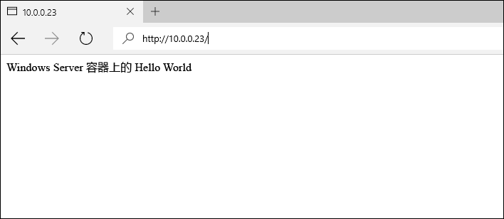
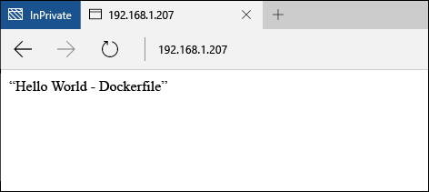

# Windows Server 上的容器映像

**这是初步内容，可能还会更改。** 

在之前的 Windows Server 快速入门中，已从预先存在的容器映像创建了 Windows 容器。 本练习中将详细介绍手动创建自定义容器映像以及如何使用 Dockerfile。

本快速入门特定于 Windows Server 2016 上的 Windows Server 容器。 此页面左侧的目录中提供其他快速入门文档。 

**先决条件：**

- 一个运行 [Windows Server 2016 Technical Preview 5](https://www.microsoft.com/en-us/evalcenter/evaluate-windows-server-technical-preview) 的计算机系统（物理或虚拟）。
- 使用 Windows 容器功能和 Docker 配置此系统。 有关这些步骤的演练，请参阅 [Windows Server 上的 Windows 容器](./quick_start_windows_server.md)。

## 1.容器映像 - 手动

为获得最佳体验，请从 Windows 命令行界面 (cmd.exe) 演练此练习。

手动创建容器映像的第一步是部署容器。 对于此示例，请从预创建的 IIS 映像部署 IIS 容器。 部署容器后，你将从该容器内部进入 shell 会话。 使用 `-it` 标识初始交互式会话。 有关 Docker Run 命令的详细信息，请参阅 [Docker.com 上的 Docker Run 参考]( https://docs.docker.com/engine/reference/run/)。 

```none
docker run -it -p 80:80 microsoft/iis cmd
```

接下来，将对容器进行修改。 运行以下命令来删除 IIS 初始屏幕。

```none
del C:\inetpub\wwwroot\iisstart.htm
```

以下内容用来将默认 IIS 站点替换为新的静态站点。

```none
echo "Hello World From a Windows Server Container" > C:\inetpub\wwwroot\index.html
```

从不同的系统，浏览到容器主机的 IP 地址。 你应该可以看到“Hello World”应用程序。

**注意：**如果你使用的是 Azure，将需要一个网络安全组规则来允许通过端口 80 通信。 有关详细信息，请参阅 [Create Rule in a Network Security Group]( https://azure.microsoft.com/en-us/documentation/articles/virtual-networks-create-nsg-arm-pportal/#create-rules-in-an-existing-nsg)（在网络安全组中创建规则）。



返回到容器中，退出交互式容器会话。

```none
exit
```

现在可以将此修改的容器捕获到新的容器映像中。 为此，你将需要容器名称。 使用 `docker ps -a` 命令可查找到该名称。

```none
docker ps -a

CONTAINER ID     IMAGE                             COMMAND   CREATED             STATUS   PORTS   NAMES
489b0b447949     microsoft/iis   "cmd"     About an hour ago   Exited           pedantic_lichterman
```

若要创建新的容器映像，请使用 `docker commit` 命令。 Docker commit 采用“docker commit container-name new-image-name”的形式。 注意 - 将此示例中的容器名称替换为实际容器名称。

```none
docker commit pedantic_lichterman modified-iis
```

若要验证是否已创建了新的映像，请使用 `docker images` 命令。  

```none
docker images

REPOSITORY          TAG                 IMAGE ID            CREATED              SIZE
modified-iis        latest              3e4fdb6ed3bc        About a minute ago   10.17 GB
microsoft/iis       windowsservercore   c26f4ceb81db        2 weeks ago          9.48 GB
windowsservercore   10.0.14300.1000     dbfee88ee9fd        8 weeks ago          9.344 GB
windowsservercore   latest              dbfee88ee9fd        8 weeks ago          9.344 GB
```

现在可以部署此映像了。 生成的容器中将包括所有捕获的修改。

## 2.容器映像 - Dockerfile

通过上一练习，已手动创建和修改容器，并已将其捕获到新容器映像中。 Docker 包含用于自动执行此过程的方法，即使用所谓的 Dockerfile。 本练习将产生与上一练习几乎相同的结果，但是这次该过程将自动执行。

在容器主机上，创建目录 `c:\build`，并在此目录中创建一个名为 `Dockerfile` 的文件。 注意 - 该文件不应具有文件扩展名。

```none
powershell new-item c:\build\Dockerfile -Force
```

使用记事本打开 Dockerfile。

```none
notepad c:\build\Dockerfile
```

将以下文本复制到 Dockerfile 并保存该文件。 这些命令指示 Docker 使用 `microsoft/iis` 为基本，创建新的映像。 然后 dockerfile 会运行在 `RUN` 指示中指定的命令，在本例中，已使用新内容更新了 index.html 文件。 

有关 Dockerfile 的详细信息，请参阅 [Windows 上的 Dockerfile](../docker/manage_windows_dockerfile.md)。

```none
FROM microsoft/iis
RUN echo "Hello World - Dockerfile" > c:\inetpub\wwwroot\index.html
```

`docker build` 命令将启动映像生成过程。 `-t` 参数会指示此生成过程将新映像命名为 `iis-dockerfile`。

```none
docker build -t iis-dockerfile c:\Build
```

完成后，你可以验证是否已使用 `docker images` 命令创建了映像。

```none
docker images

REPOSITORY          TAG                 IMAGE ID            CREATED             SIZE
iis-dockerfile      latest              8d1ab4e7e48e        2 seconds ago       9.483 GB
microsoft/iis       windowsservercore   c26f4ceb81db        2 weeks ago         9.48 GB
windowsservercore   10.0.14300.1000     dbfee88ee9fd        8 weeks ago         9.344 GB
windowsservercore   latest              dbfee88ee9fd        8 weeks ago         9.344 GB
```

现在，请使用以下命令部署容器。 

```none
docker run -d -p 80:80 iis-dockerfile ping -t localhost
```

创建容器后，浏览到容器主机的 IP 地址。 你应该可以看到 Hello World 应用程序。



返回到容器主机上，使用 `docker ps` 来获取容器的名称，然后使用 `docker rm` 来删除容器。 注意 - 将此示例中的容器名称替换为实际容器名称。

获取容器名称。

```none
docker ps

CONTAINER ID   IMAGE            COMMAND               CREATED              STATUS              PORTS                NAMES
c1dc6c1387b9   iis-dockerfile   "ping -t localhost"   About a minute ago   Up About a minute   0.0.0.0:80->80/tcp   cranky_brown
```

删除容器。

```none
docker rm -f cranky_brown
```

## 后续步骤

[Windows 10 上的 Windows 容器](./quick_start_windows_10.md)


<!--HONumber=Aug16_HO3-->


